# Hardware & Supply Store RESTful API — Software Requirements & Technical Specification

**Document Version:** 2.0  
**Date:** 2026-08-21  
**Architecture:** Laravel REST API + separate frontend  
**Market:** Philippines  
**Business Model:** B2C  
**Database:** MySQL  
**Authentication:** Laravel Sanctum  
**Payment Provider:** PayRex  
**Development Email:** Mailtrap

---

## 1. Executive Summary

This document defines the software, API, database, security, scalability, and deployment requirements for a B2C hardware and supply e-commerce platform.

The platform sells general hardware, construction/building supplies, electrical/plumbing supplies, tools, and related products.

The backend will expose versioned RESTful APIs consumed by a separate frontend. The design prioritizes security, transactional correctness, inventory integrity, payment reliability, API backward compatibility, observability, and future horizontal scaling.

The initial deployment targets Docker/Kubernetes with MySQL. Redis is recommended for cache, queues, locks, rate limiting, and short-lived checkout state.

---

# 1. Confirmed Scope

## 2.1 Included

- Customer registration/login using email and password
- Email verification
- Guest checkout
- Product catalog
- Categories/subcategories
- Brands
- Product attributes/specifications
- Product variants
- Product images
- Product documents/manuals
- Product dimensions and weight
- Warranty information
- Related products
- Accessories
- Bundles/kits
- SKU management
- Single inventory location
- Inventory history
- Stock reservation during checkout/payment
- Pricing
- Discounts/promotions
- Coupons/vouchers
- Customer-specific pricing capability
- Quantity/bulk pricing
- Tiered pricing
- Flash sales
- Cart
- Wishlist
- Recently viewed products
- Product comparison
- Back-in-stock notifications
- Price-drop notifications
- Recommendations
- Orders
- Cancellation
- Partial cancellation
- Partial fulfillment
- Backorders
- Returns
- Refunds
- Exchanges
- Order splitting
- Order notes
- Order history
- Invoice generation
- Credit notes
- COD
- Cards
- E-wallets
- QR payments
- Payment gateway integration
- PayRex
- Payment webhooks
- Idempotent payment processing
- Payment retries
- Own delivery
- Customer pickup
- Shipping fee calculation
- Free-shipping thresholds
- Delivery zones
- Weight/dimension shipping
- Carrier-rate integration capability
- Tracking numbers
- Shipment tracking
- Multiple shipments per order
- Pickup locations
- Estimated delivery dates
- One customer address
- Philippine geographic hierarchy
- Advanced product search
- Faceted filtering
- Autocomplete
- Sorting
- Synonyms
- Typo tolerance
- Inventory-aware search
- Product reviews
- Verified-purchase reviews
- Review editing/deletion
- Review helpfulness
- Review reporting
- Email notifications
- Outbound webhooks
- Admin application support
- RBAC
- Action-level permissions
- API versioning
- Pagination
- Filtering
- Sorting
- Rate limiting
- Idempotency keys
- Correlation IDs
- Consistent API errors
- OpenAPI documentation
- Audit logs
- Soft deletes
- Concurrency controls
- Backward compatibility
- Queues/background processing
- Security/audit events
- 2FA
- Session/device management
- Fraud/suspicious-login controls
- Data retention/deletion/export
- Sales, order, revenue, product, inventory, customer, refund, payment, promotion, tax, and profit/margin reporting

## 2.2 Explicitly Excluded

- Mobile-number OTP authentication
- Barcode/UPC/EAN
- Product videos
- Replacement products
- Supplier management
- Customer Support admin role
- Finance admin role
- Marketing admin role
- Multiple saved customer addresses

---

# 2. Functional Requirements

The following requirements are normative. **MUST** means mandatory for the system; **SHOULD** means recommended unless a business or technical constraint requires otherwise; **MAY** is optional.

## 3.1 Authentication and Account Management

| ID | Requirement | Priority |
|---|---|---|
| FR-AUTH-001 | The API MUST allow customers to register using email address and password. | Must |
| FR-AUTH-002 | The API MUST reject duplicate email addresses case-insensitively. | Must |
| FR-AUTH-003 | The API MUST require email verification before protected customer actions that require a verified account. | Must |
| FR-AUTH-004 | The API MUST support login and logout using Laravel Sanctum. | Must |
| FR-AUTH-005 | The API MUST support password reset using single-use, expiring reset tokens. | Must |
| FR-AUTH-006 | The API MUST rate-limit registration, login, password reset, and email verification endpoints. | Must |
| FR-AUTH-007 | Customers MUST be able to view and revoke their active sessions/devices. | Must |
| FR-AUTH-008 | The system MUST support optional 2FA for customer and administrative accounts. | Must |
| FR-AUTH-009 | The system MUST record security events for login success/failure, password changes, 2FA changes, session revocation, and account suspension. | Must |
| FR-AUTH-010 | The system MUST never store plaintext passwords. | Must |

## 3.2 Customer Profile and Address

| ID | Requirement | Priority |
|---|---|---|
| FR-CUST-001 | Customers MUST be able to view and update their profile. | Must |
| FR-CUST-002 | Customers MAY maintain exactly one active saved delivery address. | Must |
| FR-CUST-003 | The address API MUST use the Philippine geographic hierarchy defined by the system. | Must |
| FR-CUST-004 | The checkout process MUST snapshot the address used for the order. | Must |
| FR-CUST-005 | Deleting/changing the customer's saved address MUST NOT change historical order addresses. | Must |
| FR-CUST-006 | Customers MUST be able to request export or deletion of eligible personal data. | Must |

## 3.3 Catalog Management

| ID | Requirement | Priority |
|---|---|---|
| FR-CAT-001 | Administrators with catalog permissions MUST be able to create, update, publish, unpublish, archive, and restore products. | Must |
| FR-CAT-002 | Products MUST support categories, brands, descriptions, specifications, images, documents/manuals, dimensions, weight, warranty information, related products, accessories, and bundles/kits. | Must |
| FR-CAT-003 | Products MUST have one or more variants. | Must |
| FR-CAT-004 | Each product variant MUST have a unique SKU. | Must |
| FR-CAT-005 | Barcode/UPC/EAN fields MUST NOT be part of the product schema. | Must |
| FR-CAT-006 | Product videos MUST NOT be part of the product schema. | Must |
| FR-CAT-007 | Replacement-product relationships MUST NOT be part of the product relationship model. | Must |
| FR-CAT-008 | Product specifications MUST support typed values such as text, integer, decimal, boolean, and option values. | Should |
| FR-CAT-009 | Product and variant records exposed through APIs MUST use stable public identifiers and slugs rather than exposing internal database implementation details where possible. | Should |
| FR-CAT-010 | Product deletion MUST be soft deletion where historical references exist. | Must |

## 3.4 Search and Discovery

| ID | Requirement | Priority |
|---|---|---|
| FR-SRCH-001 | Customers MUST be able to search products by keyword. | Must |
| FR-SRCH-002 | Search MUST support filtering, sorting, pagination, and faceting. | Must |
| FR-SRCH-003 | Search SHOULD support autocomplete, synonyms, and typo tolerance. | Must |
| FR-SRCH-004 | Search MUST support inventory-aware availability filtering. | Must |
| FR-SRCH-005 | Search results MUST NOT expose unavailable inventory quantities unless explicitly allowed by a future business rule. | Must |
| FR-SRCH-006 | The search implementation MUST be abstracted so a dedicated search engine can replace the initial implementation without changing the public API contract. | Must |
| FR-SRCH-007 | The API SHOULD expose recent searches and/or popularity metrics only if enabled by the frontend product experience. | Optional |

## 3.5 Inventory

| ID | Requirement | Priority |
|---|---|---|
| FR-INV-001 | The system MUST maintain inventory by product variant and location. | Must |
| FR-INV-002 | The initial deployment MUST support one inventory location while retaining a location abstraction for future expansion. | Must |
| FR-INV-003 | The system MUST track quantity on hand, reserved quantity, and available quantity. | Must |
| FR-INV-004 | The system MUST record every stock-changing operation in an inventory movement ledger. | Must |
| FR-INV-005 | Inventory adjustments MUST require an authorized administrative permission. | Must |
| FR-INV-006 | Inventory reservation MUST occur only during checkout/payment as specified. | Must |
| FR-INV-007 | Inventory reservation MUST have an expiration time. | Must |
| FR-INV-008 | Expired or failed reservations MUST be released automatically by queued processing. | Must |
| FR-INV-009 | Concurrent checkout requests MUST use database locking or equivalent atomic concurrency controls to prevent overselling. | Must |
| FR-INV-010 | Available quantity MUST be calculated server-side as quantity on hand minus active reservations. | Must |

## 3.6 Cart and Checkout

| ID | Requirement | Priority |
|---|---|---|
| FR-CART-001 | The system MUST support guest and authenticated carts. | Must |
| FR-CART-002 | A guest cart MUST be mergeable into the authenticated customer's cart after login. | Must |
| FR-CART-003 | Cart items MUST reference product variants, not mutable product prices. | Must |
| FR-CART-004 | The checkout process MUST re-read authoritative product, price, promotion, tax, shipping, and inventory data. | Must |
| FR-CART-005 | Client-provided totals MUST NEVER be trusted. | Must |
| FR-CART-006 | The checkout process MUST create inventory reservations before the order/payment operation is considered successful. | Must |
| FR-CART-007 | Checkout MUST support COD, cards, e-wallets, QR payments, and PayRex gateway payment flows. | Must |
| FR-CART-008 | Checkout requests that create financial side effects MUST support idempotency keys. | Must |
| FR-CART-009 | Checkout MUST fail safely when stock, pricing, promotion, or payment requirements become invalid between cart creation and checkout. | Must |

## 3.7 Pricing, Promotions, and Coupons

| ID | Requirement | Priority |
|---|---|---|
| FR-PRICE-001 | The system MUST support a base selling price for every purchasable variant. | Must |
| FR-PRICE-002 | The system MUST support sale pricing and scheduled pricing windows. | Must |
| FR-PRICE-003 | The system MUST support quantity/bulk pricing and tiered pricing. | Must |
| FR-PRICE-004 | The system MUST support customer-specific pricing rules. | Must |
| FR-PRICE-005 | The system MUST support promotions, discounts, flash sales, and free-shipping promotions. | Must |
| FR-PRICE-006 | The system MUST support coupons/vouchers with eligibility, usage limits, validity windows, and redemption tracking. | Must |
| FR-PRICE-007 | Price history MUST be retained for audit/reporting purposes. | Must |
| FR-PRICE-008 | Promotions MUST be validated server-side during cart and checkout operations. | Must |
| FR-PRICE-009 | Pricing arithmetic MUST use exact monetary arithmetic; floating-point values MUST NOT be used for final financial calculations. | Must |

## 3.8 Orders

| ID | Requirement | Priority |
|---|---|---|
| FR-ORD-001 | The system MUST create an order only after authoritative checkout validation succeeds. | Must |
| FR-ORD-002 | Orders MUST preserve item, price, tax, discount, shipping, and address snapshots. | Must |
| FR-ORD-003 | The system MUST support order cancellation according to allowed state transitions. | Must |
| FR-ORD-004 | The system MUST support partial cancellation. | Must |
| FR-ORD-005 | The system MUST support partial fulfillment and multiple shipments per order. | Must |
| FR-ORD-006 | The system MUST support returns, refunds, and exchanges. | Must |
| FR-ORD-007 | The system MUST support order notes and status history. | Must |
| FR-ORD-008 | Invoice and credit-note records MUST be immutable historical documents once issued, except for explicitly permitted corrective actions. | Must |
| FR-ORD-009 | Order totals MUST reconcile to their item and adjustment components. | Must |
| FR-ORD-010 | Customers MUST only be able to access their own orders. | Must |

## 3.9 Payments

| ID | Requirement | Priority |
|---|---|---|
| FR-PAY-001 | The system MUST isolate payment-provider logic behind a gateway interface/adapter. | Must |
| FR-PAY-002 | PayRex MUST be the initial external payment provider implementation. | Must |
| FR-PAY-003 | Payment creation, retries, and refunds MUST be idempotent. | Must |
| FR-PAY-004 | Payment status MUST be driven by verified provider responses/webhooks and server-side verification, not by client redirects alone. | Must |
| FR-PAY-005 | Payment attempts MUST be retained as separate historical records. | Must |
| FR-PAY-006 | Duplicate payment webhook events MUST NOT create duplicate business effects. | Must |
| FR-PAY-007 | Failed payments MUST support retry according to a controlled retry policy. | Must |
| FR-PAY-008 | Refunds MUST never exceed the refundable captured amount. | Must |
| FR-PAY-009 | Payment secrets MUST remain server-side and MUST NOT be returned by the API. | Must |

## 3.10 Shipping and Pickup

| ID | Requirement | Priority |
|---|---|---|
| FR-SHIP-001 | The system MUST support own delivery and customer pickup. | Must |
| FR-SHIP-002 | Shipping rates MUST support delivery zones and weight/dimension-based calculations. | Must |
| FR-SHIP-003 | Free-shipping thresholds MUST be supported. | Must |
| FR-SHIP-004 | Orders MUST support multiple shipments. | Must |
| FR-SHIP-005 | Each shipment MUST track its own status and tracking events. | Must |
| FR-SHIP-006 | Pickup orders MUST reference an active pickup location. | Must |
| FR-SHIP-007 | Estimated delivery dates MUST be calculated/stored without overwriting actual delivery timestamps. | Must |

## 3.11 Reviews and Customer Engagement

| ID | Requirement | Priority |
|---|---|---|
| FR-REV-001 | Only verified purchasers MUST be allowed to submit a product review. A customer may have at most one active review per product. | Must |
| FR-REV-002 | Customers MUST be able to create, edit, and delete their own review subject to moderation/business rules. | Must |
| FR-REV-003 | Reviews MUST support rating, title, and text content. | Must |
| FR-REV-004 | Image and video attachments MUST NOT be supported. | Must |
| FR-REV-005 | Customers MUST be able to mark reviews as helpful and report reviews. | Must |
| FR-REV-006 | The system MUST support moderation states for reviews. | Must |
| FR-DISC-001 | Customers MUST be able to manage a wishlist. | Must |
| FR-DISC-002 | The system MUST support recently viewed products. | Must |
| FR-DISC-003 | The system MUST support product comparison. | Must |
| FR-DISC-004 | The system MUST support back-in-stock and price-drop notification eligibility. | Must |
| FR-DISC-005 | The system MUST support rule-based product recommendations initially. | Must |

## 3.12 Notifications and Webhooks

| ID | Requirement | Priority |
|---|---|---|
| FR-NOTIF-001 | System email notifications MUST be queued. | Must |
| FR-NOTIF-002 | Customers MUST be able to manage supported notification preferences. | Must |
| FR-NOTIF-003 | The system MUST support outbound webhooks with signed payloads. | Must |
| FR-NOTIF-004 | Webhook deliveries MUST be retried with controlled backoff. | Must |
| FR-NOTIF-005 | Webhook deliveries MUST be idempotently tracked. | Must |

## 3.13 Administration and RBAC

| ID | Requirement | Priority |
|---|---|---|
| FR-ADMIN-001 | Administrative APIs MUST require authenticated administrative access. | Must |
| FR-ADMIN-002 | Administrative access MUST be governed by roles and individual permissions. | Must |
| FR-ADMIN-003 | Super Administrator MUST be able to manage roles and permissions. | Must |
| FR-ADMIN-004 | Catalog, Inventory, Order, and general Administration roles MUST be separable by permission sets. | Must |
| FR-ADMIN-005 | Customer Support, Finance, and Marketing roles MUST NOT be created as required built-in roles under this scope. | Must |
| FR-ADMIN-006 | Sensitive administrative actions MUST generate audit events. | Must |

## 3.14 Reporting

| ID | Requirement | Priority |
|---|---|---|
| FR-RPT-001 | The system MUST provide sales, orders, revenue, products, inventory, low-stock, customer, refund, payment, promotion, tax, and profit/margin reports. | Must |
| FR-RPT-002 | Reports MUST support date-range filtering. | Must |
| FR-RPT-003 | Large reports MUST run asynchronously. | Must |
| FR-RPT-004 | Generated report files MUST be stored outside the application container filesystem for production deployments. | Must |
| FR-RPT-005 | Report access MUST respect administrative permissions. | Must |


# 3. Non-Functional Requirements

## 4.1 Security

| ID | Requirement | Target |
|---|---|---|
| NFR-SEC-001 | All production API traffic MUST use HTTPS/TLS. | 100% |
| NFR-SEC-002 | Passwords MUST be hashed using Laravel's supported secure password hashing. | 100% |
| NFR-SEC-003 | Authentication, authorization, and business-rule checks MUST be enforced server-side. | 100% |
| NFR-SEC-004 | Sensitive secrets MUST be stored in environment/secret-management infrastructure, never source code or client payloads. | 100% |
| NFR-SEC-005 | APIs MUST validate request bodies, path parameters, query parameters, sort fields, filters, and uploaded files. | 100% |
| NFR-SEC-006 | The API MUST protect against broken object-level authorization (IDOR/BOLA). | Required |
| NFR-SEC-007 | Payment webhooks MUST be cryptographically verified before business processing. | Required |
| NFR-SEC-008 | Financial endpoints MUST support idempotency and replay protection. | Required |
| NFR-SEC-009 | Administrative endpoints MUST require explicit permissions. | Required |
| NFR-SEC-010 | Sensitive data MUST be excluded from application logs. | Required |
| NFR-SEC-011 | File uploads MUST be validated by MIME type, size, extension, and storage policy. | Required |
| NFR-SEC-012 | Security events MUST be retained according to the system retention policy. | Required |

## 4.2 Performance

| ID | Requirement | Target |
|---|---|---|
| NFR-PERF-001 | Standard catalog read APIs SHOULD achieve p95 latency of 300 ms or less under the agreed baseline load. | <=300 ms |
| NFR-PERF-002 | Standard authenticated write APIs SHOULD achieve p95 latency of 500 ms or less excluding external provider latency. | <=500 ms |
| NFR-PERF-003 | Search APIs SHOULD achieve p95 latency of 500 ms or less under the agreed baseline load. | <=500 ms |
| NFR-PERF-004 | API endpoints MUST avoid N+1 queries. | Required |
| NFR-PERF-005 | Large exports/reports MUST be asynchronous. | Required |
| NFR-PERF-006 | Slow external calls MUST NOT block webhook acknowledgement longer than necessary. | Required |

## 4.3 Scalability

| ID | Requirement | Target |
|---|---|---|
| NFR-SCALE-001 | API application instances MUST be stateless and horizontally scalable. | Required |
| NFR-SCALE-002 | Queue workers MUST scale independently of API workers. | Required |
| NFR-SCALE-003 | Database access MUST be designed so read replicas can be introduced later. | Required |
| NFR-SCALE-004 | Search MUST be abstracted so a dedicated search engine can be introduced without changing API contracts. | Required |
| NFR-SCALE-005 | The initial system SHOULD support at least 10,000 customers, 10,000 products, 50,000 variants, 1,000 orders/day, and 100 peak requests/second without architectural redesign. | Baseline |

## 4.4 Availability and Reliability

| ID | Requirement | Target |
|---|---|---|
| NFR-REL-001 | Production API availability target. | 99.9% monthly |
| NFR-REL-002 | Critical financial operations MUST be transactionally consistent. | Required |
| NFR-REL-003 | Queue jobs MUST be retryable and dead-letter/failure observable. | Required |
| NFR-REL-004 | Webhook consumers MUST be idempotent. | Required |
| NFR-REL-005 | Inventory operations MUST remain correct under concurrent checkout. | Required |
| NFR-REL-006 | Database backups MUST be automated and restoration MUST be tested. | Required |
| NFR-REL-007 | Recommended recovery point objective (RPO). | <=15 min |
| NFR-REL-008 | Recommended recovery time objective (RTO). | <=1 hour |

## 4.5 Data Integrity

| ID | Requirement | Target |
|---|---|---|
| NFR-DATA-001 | Foreign-key relationships MUST be enforced by the relational database for owned transactional records. | Required |
| NFR-DATA-002 | Financial records MUST be immutable where required for auditability. | Required |
| NFR-DATA-003 | Order item and order address snapshots MUST preserve historical values. | Required |
| NFR-DATA-004 | Inventory changes MUST be represented in an auditable movement ledger. | Required |
| NFR-DATA-005 | Monetary calculations MUST use exact arithmetic. | Required |
| NFR-DATA-006 | Soft-deleted records MUST not be returned by default to public APIs. | Required |

## 4.6 Maintainability

| ID | Requirement | Target |
|---|---|---|
| NFR-MNT-001 | Business logic MUST NOT be implemented directly in controllers. | Required |
| NFR-MNT-002 | External payment integrations MUST use adapters/interfaces. | Required |
| NFR-MNT-003 | Public API contracts MUST be documented with OpenAPI. | Required |
| NFR-MNT-004 | Critical business rules MUST have automated tests. | Required |
| NFR-MNT-005 | API versions MUST be backward compatible unless a new major version is introduced. | Required |

## 4.7 Observability

| ID | Requirement | Target |
|---|---|---|
| NFR-OBS-001 | Every API request SHOULD have a request/correlation ID. | Required |
| NFR-OBS-002 | Application logs MUST be structured and machine-readable in production. | Required |
| NFR-OBS-003 | Payment, webhook, queue, inventory, and authentication failures MUST be observable. | Required |
| NFR-OBS-004 | Queue depth, failure rate, API latency, error rate, database health, and Redis health MUST be monitorable. | Required |

## 4.8 Compatibility

| ID | Requirement | Target |
|---|---|---|
| NFR-COMP-001 | Public API versioning MUST use `/api/v1` and future versions when breaking changes are introduced. | Required |
| NFR-COMP-002 | Additive non-breaking changes SHOULD be preferred within an API version. | Required |
| NFR-COMP-003 | Deprecated fields/endpoints MUST have a documented deprecation period. | Required |

## 4.9 Privacy

| ID | Requirement | Target |
|---|---|---|
| NFR-PRIV-001 | The system MUST provide customer data export for eligible personal data. | Required |
| NFR-PRIV-002 | The system MUST support account deletion/anonymization workflows that preserve legally/audit-required financial history. | Required |
| NFR-PRIV-003 | Personal data access MUST be permission-controlled. | Required |


# 4. Recommended Technology Stack

| Layer | Recommendation |
|---|---|
| Backend | Laravel 13.x |
| API | REST/JSON |
| Authentication | Laravel Sanctum |
| Database | MySQL 8.x+ |
| Cache | Redis |
| Queue | Redis initially |
| Search | Dedicated search abstraction; Meilisearch/OpenSearch can be introduced |
| Object Storage | S3-compatible storage |
| Containers | Docker |
| Orchestration | Kubernetes-ready |
| Web Server | Nginx |
| PHP | Current Laravel-supported PHP version |
| API Documentation | OpenAPI |
| Development Email | Mailtrap |
| Payments | PayRex |
| Testing | PHPUnit/Pest + Laravel HTTP tests |
| CI/CD | Containerized CI pipeline |

Laravel currently recommends Sanctum for first-party SPA/API architectures, and Sanctum supports both stateful SPA authentication and API tokens. citeturn0search0turn0search1

---

# 5. High-Level Architecture

```text
                    +----------------------+
                    |      Frontend        |
                    | Web / SPA / Mobile   |
                    +----------+-----------+
                               |
                               | HTTPS REST/JSON
                               v
                    +----------------------+
                    |   API Load Balancer  |
                    +----------+-----------+
                               |
             +-----------------+-----------------+
             |                                   |
             v                                   v
     +---------------+                    +---------------+
     | Laravel API   |                    | Laravel API   |
     | Container #1  |                    | Container #N  |
     +-------+-------+                    +-------+-------+
             |                                    |
             +----------------+-------------------+
                              |
             +----------------+----------------+
             |                |                |
             v                v                v
         +-------+        +-------+        +---------+
         | MySQL |        | Redis |        | Search  |
         +-------+        +-------+        +---------+
             |
             v
       +-------------+
       | Object      |
       | Storage/CDN |
       +-------------+

External:
    PayRex
    Email provider
    Delivery/Carrier services
```

---

# 6. Architectural Principles

1. Controllers must remain thin.
2. Business logic belongs in application/domain services or actions.
3. Payment logic must be isolated behind a payment-provider abstraction.
4. Inventory mutations must be transactional.
5. Order, payment, shipment, and inventory are separate domains.
6. External webhooks must be idempotent.
7. All money must use integer minor units or fixed-precision decimal values consistently.
8. Never trust client-provided prices, stock, discounts, totals, or payment status.
9. Checkout must recalculate all authoritative totals server-side.
10. Sensitive credentials must never be committed to source control.
11. API responses must use stable resource contracts.
12. Database writes that affect multiple aggregates must use explicit transactions.
13. Long-running work must use queues.
14. Read-heavy catalog/search workloads should be cacheable.
15. Database constraints must enforce critical invariants in addition to application validation.

---

# 7. User Roles

## 6.1 Customer

Capabilities:

- Register/login
- Verify email
- Manage profile
- Manage one primary address
- Browse products
- Search/filter
- Manage cart
- Checkout
- Pay
- Track orders
- Cancel eligible orders
- Request returns/refunds
- Request exchanges
- Review purchased products
- Wishlist
- Compare products
- View recently viewed products
- Manage notification preferences
- Manage sessions/devices

## 6.2 Administrative Roles

Required roles:

- Super Administrator
- Administrator
- Catalog Manager
- Inventory Manager
- Order Manager

Administrative authorization must be permission-based rather than role-name-based.

Example permissions:

```text
products.view
products.create
products.update
products.delete
products.publish

inventory.view
inventory.adjust
inventory.reserve
inventory.release

orders.view
orders.update
orders.cancel
orders.fulfill
orders.refund

users.view
users.update
users.suspend

reports.view
reports.export
```

---

# 8. Authentication & Authorization

## 7.1 Customer Authentication

Required:

- Email/password registration
- Email verification
- Login throttling
- Password hashing using Laravel's supported password hashing
- Password reset
- Session/device management
- Token revocation
- Optional 2FA
- Suspicious login detection

Sanctum API tokens are hashed before storage and routes can be protected using `auth:sanctum`. citeturn0search0

## 7.2 API Authentication

Recommended:

```http
Authorization: Bearer <token>
```

For a first-party SPA, use Sanctum's stateful SPA authentication where domain architecture permits it.

## 7.3 Authorization

Use:

- Policies
- Gates
- Permission middleware
- Token abilities where appropriate
- Administrative role/permission mapping

Never rely exclusively on frontend authorization.

---

# 9. API Standards

Base URL:

```text
/api/v1
```

Example:

```http
GET /api/v1/products
GET /api/v1/products/{product}
POST /api/v1/cart/items
POST /api/v1/checkout
GET /api/v1/orders/{order}
```

## 8.1 Response Envelope

Success:

```json
{
  "data": {},
  "meta": {},
  "request_id": "01J..."
}
```

Error:

```json
{
  "error": {
    "code": "ORDER_NOT_FOUND",
    "message": "The requested order was not found.",
    "details": {}
  },
  "request_id": "01J..."
}
```

## 8.2 HTTP Status Codes

Use:

- 200 OK
- 201 Created
- 202 Accepted
- 204 No Content
- 400 Bad Request
- 401 Unauthorized
- 403 Forbidden
- 404 Not Found
- 409 Conflict
- 422 Validation Error
- 429 Too Many Requests
- 500 Internal Server Error
- 502/503/504 for dependency/service failures

---

# 10. Idempotency

Idempotency is mandatory for financial and state-changing operations.

Client sends:

```http
Idempotency-Key: <unique-key>
```

Required operations:

- Checkout
- Create payment
- Confirm payment
- Refund
- Cancel order
- Create shipment where externally consequential
- Webhook processing

Suggested table:

```text
idempotency_keys
```

Columns:

- id
- key
- user_id nullable
- endpoint
- request_hash
- response_status
- response_body
- created_at
- expires_at

Unique constraint:

```text
(user_id, key, endpoint)
```

A reused key with a different request payload must return a conflict.

---

# 11. Product Catalog

## Entities

```text
categories
brands
products
product_variants
product_images
product_documents
product_attributes
attribute_values
product_attribute_values
product_relations
product_bundles
product_bundle_items
```

## Product

Required fields:

- id
- category_id
- brand_id nullable
- name
- slug
- description
- short_description
- status
- warranty information
- weight
- length
- width
- height
- created_at
- updated_at
- deleted_at

## Product Variant

Required:

- id
- product_id
- SKU
- variant name
- price
- compare-at price nullable
- cost
- weight override nullable
- dimensions overrides nullable
- status

SKU must be unique.

---

# 12. Product Categories

Hierarchical categories:

```text
Hardware
├── Hand Tools
├── Power Tools
├── Fasteners
├── Building Materials
├── Electrical
├── Plumbing
└── Safety Equipment
```

Categories should support:

- Parent/child hierarchy
- Slug
- Sort order
- Active/inactive
- SEO metadata
- Soft deletion

Recommended indexing:

```text
parent_id
slug
status
```

---

# 13. Inventory

Initial deployment uses one inventory location but the schema should retain a `locations` abstraction so future multiple warehouses/stores can be introduced without redesigning the inventory domain.

Core entities:

```text
locations
inventories
inventory_movements
inventory_reservations
```

## Inventory fields

```text
inventory_id
location_id
product_variant_id
quantity_on_hand
quantity_reserved
quantity_available
reorder_level
updated_at
```

Availability:

```text
quantity_available =
    quantity_on_hand - quantity_reserved
```

Do not trust a client-calculated quantity.

## Inventory movement types

```text
purchase
sale
return
adjustment
damage
loss
transfer
reservation
reservation_release
```

Every stock-changing operation must create an auditable movement.

---

# 14. Checkout Inventory Reservation

Reservation happens only during checkout/payment, as requested.

Recommended flow:

```text
Cart
  |
  v
Checkout validation
  |
  v
Recalculate price
  |
  v
Begin DB transaction
  |
  v
Lock inventory rows
  |
  v
Verify available quantity
  |
  v
Create reservation
  |
  v
Create order
  |
  v
Create payment
  |
  v
Commit
```

Use row-level locking for inventory.

Reservations require an expiration timestamp.

Expired reservations must be released by a queued scheduled job.

---

# 15. Cart

Entities:

```text
carts
cart_items
```

Cart must support:

- Authenticated users
- Guest carts
- Cart merge after login
- Quantity changes
- Remove items
- Clear cart
- Coupon application
- Price recalculation
- Stock validation

The cart must never be treated as the source of truth for final pricing.

---

# 16. Pricing & Promotions

Entities:

```text
prices
price_histories
promotions
promotion_rules
promotion_products
coupons
coupon_redemptions
customer_price_rules
```

Promotion types:

- Percentage
- Fixed amount
- Buy X get Y
- Quantity discount
- Tiered pricing
- Flash sale
- Free shipping

Every promotion must define:

- Start
- End
- Active status
- Eligibility
- Usage limits
- Customer limits
- Product/category applicability

Price calculation should be deterministic and testable.

---

# 17. Orders

Core entities:

```text
orders
order_items
order_status_histories
order_notes
order_adjustments
order_addresses
```

Recommended order statuses:

```text
pending
awaiting_payment
paid
processing
packed
partially_fulfilled
fulfilled
shipped
partially_delivered
delivered
completed
cancelled
partially_cancelled
returned
partially_returned
refunded
```

The system must validate legal state transitions.

---

# 18. Order Snapshotting

Order items must store immutable snapshots of important commercial data:

- Product name
- SKU
- Variant
- Unit price
- Discount
- Tax
- Quantity
- Line total

Do not depend on the current product record to reconstruct historical orders.

Likewise, shipping/billing address information used for an order should be snapshotted into the order.

---

# 19. Payments

Entities:

```text
payments
payment_transactions
payment_attempts
payment_webhooks
refunds
refund_items
```

Payment methods:

```text
cod
card
e_wallet
qr
gateway
```

Payment statuses:

```text
pending
processing
authorized
paid
failed
cancelled
expired
partially_refunded
refunded
```

## Payment abstraction

```php
interface PaymentGateway
{
    public function createPayment(
        PaymentRequest $request
    ): PaymentResult;

    public function getPayment(
        string $providerReference
    ): PaymentResult;

    public function refund(
        RefundRequest $request
    ): RefundResult;

    public function verifyWebhook(
        string $payload,
        array $headers
    ): WebhookEvent;
}
```

PayRex becomes:

```text
PayrexPaymentGateway implements PaymentGateway
```

This prevents PayRex-specific implementation from leaking throughout the application.

---

# 20. PayRex Webhooks

PayRex webhooks must be treated as untrusted external input until:

1. Raw request body is captured.
2. Signature is verified.
3. Event ID/provider reference is checked for duplicates.
4. Payload schema is validated.
5. Event is persisted.
6. Business processing is queued where appropriate.

PayRex documents webhook signature verification using the raw payload and HMAC-SHA256 and advises returning 2xx after successful handling; failed deliveries may be retried. citeturn0search2

Recommended endpoint:

```http
POST /api/v1/webhooks/payrex
```

Webhook processing:

```text
PayRex
  |
  v
HTTPS webhook
  |
  v
Verify signature
  |
  +---- invalid ---> 400/401
  |
  v
Persist event
  |
  v
Return 2xx quickly
  |
  v
Queue processing
  |
  v
Update payment/order
```

Never perform long-running order operations synchronously inside the webhook HTTP request.

---

# 21. Payment Retry

Payment retries must create separate payment attempts rather than overwriting historical attempts.

```text
payment
  |
  +-- attempt 1 -> failed
  |
  +-- attempt 2 -> failed
  |
  +-- attempt 3 -> paid
```

Each attempt records:

- provider
- provider reference
- amount
- currency
- request ID
- status
- failure code
- failure reason
- timestamps

---

# 22. Shipping & Pickup

Entities:

```text
shipping_methods
shipping_zones
shipping_rates
shipments
shipment_items
shipment_tracking_events
pickup_locations
```

Supports:

- Own delivery
- Customer pickup
- Shipping zones
- Weight-based pricing
- Dimension-based pricing
- Free shipping
- Tracking
- Multiple shipments per order
- Estimated delivery
- Carrier integration capability

A shipment belongs to an order but should not be assumed to contain every order item.

---

# 23. Customer Address

Only one saved address is required.

Entities:

```text
customer_addresses
countries
regions
provinces
cities
barangays
postal_codes
```

Philippine address hierarchy:

```text
Country
  -> Region
      -> Province
          -> City/Municipality
              -> Barangay
                  -> Postal Code
```

Order addresses must be snapshotted.

---

# 24. Reviews

Entities:

```text
reviews
review_helpful_votes
review_reports
```

Requirements:

- Verified purchase required
- One review per eligible order item unless business rules explicitly permit updates
- Rating
- Title
- Body
- Edit
- Delete
- Helpful voting
- Reporting
- Moderation status

No image or video uploads.

Recommended moderation states:

```text
pending
published
rejected
hidden
```

---

# 25. Wishlist & Discovery

Entities:

```text
wishlists
wishlist_items
recently_viewed_products
product_comparisons
recommendation_events
```

Features:

- Wishlist
- Recently viewed
- Product comparison
- Back-in-stock notifications
- Price-drop notifications
- Recommendations

Recommendations should initially use deterministic rules such as:

- Frequently bought together
- Related products
- Category affinity
- Recently viewed
- Popular products

A machine-learning recommendation service can be introduced later.

---

# 26. Notifications

Required channel:

```text
Email
Outbound Webhooks
```

Entities:

```text
notifications
notification_preferences
notification_deliveries
webhook_endpoints
webhook_deliveries
```

Events include:

- Account registration
- Email verification
- Password reset
- Order created
- Payment successful
- Payment failed
- Order shipped
- Order delivered
- Order cancelled
- Refund completed
- Back in stock
- Price drop

Email delivery should be queued.

Mailtrap is used for development/testing only.

---

# 27. Webhooks

Outbound webhook architecture:

```text
Domain Event
   |
   v
Webhook Dispatcher
   |
   v
Webhook Delivery
   |
   v
Queue
   |
   v
External Consumer
```

Webhook delivery must include:

- Event ID
- Event type
- API version
- Timestamp
- Payload
- Signature

Retries should use exponential backoff.

Webhook delivery status:

```text
pending
processing
delivered
failed
exhausted
```

---

# 28. Search

The search API should support:

```text
?q=drill
&category=power-tools
&brand=...
&min_price=...
&max_price=...
&in_stock=true
&sort=price_asc
&page=1
&per_page=24
```

Capabilities:

- Full-text search
- Filters
- Facets
- Sorting
- Pagination
- Autocomplete
- Typo tolerance
- Synonyms
- Inventory-aware search

Search should be abstracted behind a search service:

```php
interface ProductSearch
{
    public function search(ProductSearchQuery $query): SearchResult;
}
```

This allows MySQL search initially and a dedicated search engine later.

---

# 29. Reporting

Reports:

- Sales
- Orders
- Revenue
- Products
- Inventory
- Low stock
- Customers
- Refunds
- Payments
- Promotions
- Tax
- Profit
- Margin

Large reports must run asynchronously.

Recommended workflow:

```text
POST /reports
       |
       v
Create report job
       |
       v
Queue
       |
       v
Generate file
       |
       v
Object storage
       |
       v
GET /reports/{id}
```

---

# 30. Audit Logging

Entities:

```text
audit_logs
security_events
admin_activity_logs
```

Audit fields:

```text
id
actor_type
actor_id
action
resource_type
resource_id
old_values
new_values
ip_address
user_agent
request_id
created_at
```

Sensitive secrets must never be logged.

Audit logging is required for:

- Admin changes
- Product changes
- Inventory adjustments
- Order status changes
- Refunds
- Payment operations
- User suspension
- Permission changes
- Authentication/security events

---

# 31. Authoritative Database Design

This section is the **authoritative implementation-level database design**. It supersedes the earlier high-level table summary in previous revisions. Every table below is intended to map to a Laravel migration/model unless explicitly marked as a Laravel framework table.

## 30.1 Database Conventions

- Database engine: MySQL 8.x or later.
- Primary keys: `BIGINT UNSIGNED AUTO_INCREMENT` for internal relational efficiency.
- Public resources SHOULD expose a separate `ulid CHAR(26) UNIQUE` rather than internal numeric IDs.
- Monetary amounts: `BIGINT` minor units (for example, centavos) plus `currency_code CHAR(3)`.
- Quantities: `DECIMAL(18,3)` to support materials sold by whole units or fractional quantities where future business rules require it.
- Timestamps: `DATETIME(6)` UTC.
- Soft deletable entities use nullable `deleted_at DATETIME(6)`.
- Status columns use `VARCHAR`/string-backed enums at the database boundary so new application states do not require destructive database enum changes.
- Foreign keys MUST be indexed.
- All unique business identifiers MUST have unique indexes.
- JSON is permitted for provider payloads, structured metadata, and extensible configuration, but core relational fields used for filtering, joining, reporting, or authorization MUST be normalized into columns.

## 30.2 Identity and Access Tables

### `users`

| Field | Type | Null | Key | Description |
|---|---|---|---|---|
| id | BIGINT UNSIGNED | NO | PK | Internal user ID |
| ulid | CHAR(26) | NO | UQ | Public identifier |
| email | VARCHAR(255) | NO | UQ | Login email; stored normalized |
| password | VARCHAR(255) | NO | | Password hash |
| first_name | VARCHAR(100) | NO | | First name |
| last_name | VARCHAR(100) | NO | | Last name |
| phone | VARCHAR(30) | YES | | Optional contact number; not used for OTP login |
| status | VARCHAR(30) | NO | IDX | active/suspended/deleted |
| email_verified_at | DATETIME(6) | YES | IDX | Verification timestamp |
| two_factor_enabled | BOOLEAN | NO | | Whether 2FA is enabled |
| last_login_at | DATETIME(6) | YES | | Last successful login |
| created_at | DATETIME(6) | NO | | Creation time |
| updated_at | DATETIME(6) | NO | | Last update |
| deleted_at | DATETIME(6) | YES | IDX | Soft deletion |

### `roles`

| Field | Type | Null | Key | Description |
|---|---|---|---|---|
| id | BIGINT UNSIGNED | NO | PK | Role ID |
| name | VARCHAR(100) | NO | UQ | Role name |
| slug | VARCHAR(120) | NO | UQ | Stable role key |
| description | VARCHAR(500) | YES | | Role description |
| is_system | BOOLEAN | NO | | Prevent unsafe deletion of system roles |
| created_at | DATETIME(6) | NO | | |
| updated_at | DATETIME(6) | NO | | |

Required seed roles: `super_admin`, `admin`, `catalog_manager`, `inventory_manager`, `order_manager`.

### `permissions`

| Field | Type | Null | Key | Description |
|---|---|---|---|---|
| id | BIGINT UNSIGNED | NO | PK | Permission ID |
| name | VARCHAR(150) | NO | UQ | Human-readable permission |
| slug | VARCHAR(180) | NO | UQ | Stable API/action permission key |
| module | VARCHAR(80) | NO | IDX | Permission group |
| created_at | DATETIME(6) | NO | | |
| updated_at | DATETIME(6) | NO | | |

Examples: `products.view`, `products.create`, `inventory.adjust`, `orders.refund`, `reports.export`.

### `role_user`

| Field | Type | Null | Key | Description |
|---|---|---|---|---|
| role_id | BIGINT UNSIGNED | NO | PK/FK | Role |
| user_id | BIGINT UNSIGNED | NO | PK/FK | User |
| created_at | DATETIME(6) | NO | | Assignment time |

Primary key: `(role_id, user_id)`.

### `permission_role`

| Field | Type | Null | Key | Description |
|---|---|---|---|---|
| permission_id | BIGINT UNSIGNED | NO | PK/FK | Permission |
| role_id | BIGINT UNSIGNED | NO | PK/FK | Role |
| created_at | DATETIME(6) | NO | | Assignment time |

Primary key: `(permission_id, role_id)`.

### `user_sessions`

| Field | Type | Null | Key | Description |
|---|---|---|---|---|
| id | BIGINT UNSIGNED | NO | PK | Session record |
| user_id | BIGINT UNSIGNED | NO | FK/IDX | Owner |
| token_hash | CHAR(64) | NO | UQ | Hashed device/session token |
| device_name | VARCHAR(150) | YES | | Friendly device name |
| user_agent | VARCHAR(1000) | YES | | User agent snapshot |
| ip_address | VARCHAR(45) | YES | | IPv4/IPv6 |
| last_used_at | DATETIME(6) | YES | | Last use |
| expires_at | DATETIME(6) | NO | IDX | Expiration |
| revoked_at | DATETIME(6) | YES | IDX | Explicit revocation |
| created_at | DATETIME(6) | NO | | |
| updated_at | DATETIME(6) | NO | | |

### `two_factor_credentials`

| Field | Type | Null | Key | Description |
|---|---|---|---|---|
| id | BIGINT UNSIGNED | NO | PK | 2FA credential |
| user_id | BIGINT UNSIGNED | NO | UQ/FK | Owner |
| secret_encrypted | TEXT | NO | | Encrypted TOTP secret |
| recovery_codes_encrypted | TEXT | YES | | Encrypted recovery codes |
| confirmed_at | DATETIME(6) | YES | | Confirmation timestamp |
| created_at | DATETIME(6) | NO | | |
| updated_at | DATETIME(6) | NO | | |

### Laravel framework authentication tables

Use the standard Laravel tables required by the selected authentication stack, including `personal_access_tokens`, `password_reset_tokens`, `failed_jobs`, `jobs`, `job_batches`, and `cache`/`cache_locks` where configured. Their exact schema SHOULD follow the installed Laravel version's migrations.

## 30.3 Geography and Address Tables

### `countries`

| Field | Type | Null | Key | Description |
|---|---|---|---|---|
| id | BIGINT UNSIGNED | NO | PK | Country ID |
| iso2 | CHAR(2) | NO | UQ | ISO-3166 alpha-2 |
| iso3 | CHAR(3) | NO | UQ | ISO-3166 alpha-3 |
| name | VARCHAR(150) | NO | UQ | Country name |
| is_active | BOOLEAN | NO | IDX | Availability |
| created_at | DATETIME(6) | NO | | |
| updated_at | DATETIME(6) | NO | | |

### `regions`

`id`, `country_id FK`, `code`, `name`, `is_active`, timestamps. Unique `(country_id, code)`.

### `provinces`

`id`, `region_id FK`, `code`, `name`, `is_active`, timestamps. Unique `(region_id, code)`.

### `cities`

`id`, `province_id FK NULLABLE`, `region_id FK`, `code`, `name`, `city_type`, `is_active`, timestamps. Index `(region_id, province_id, name)`.

### `barangays`

`id`, `city_id FK`, `code`, `name`, `is_active`, timestamps. Unique `(city_id, code)`.

### `postal_codes`

| Field | Type | Null | Key | Description |
|---|---|---|---|---|
| id | BIGINT UNSIGNED | NO | PK | Postal record |
| country_id | BIGINT UNSIGNED | NO | FK/IDX | Country |
| region_id | BIGINT UNSIGNED | YES | FK/IDX | Region |
| province_id | BIGINT UNSIGNED | YES | FK/IDX | Province |
| city_id | BIGINT UNSIGNED | YES | FK/IDX | City |
| barangay_id | BIGINT UNSIGNED | YES | FK/IDX | Barangay |
| code | VARCHAR(20) | NO | IDX | Postal code |
| created_at | DATETIME(6) | NO | | |
| updated_at | DATETIME(6) | NO | | |

### `customer_addresses`

Only one active saved address is allowed per customer in the current scope.

| Field | Type | Null | Key | Description |
|---|---|---|---|---|
| id | BIGINT UNSIGNED | NO | PK | Address ID |
| ulid | CHAR(26) | NO | UQ | Public identifier |
| user_id | BIGINT UNSIGNED | NO | UQ/FK | Customer; one active row per user |
| country_id | BIGINT UNSIGNED | NO | FK | Country |
| region_id | BIGINT UNSIGNED | NO | FK | Region |
| province_id | BIGINT UNSIGNED | YES | FK | Province where applicable |
| city_id | BIGINT UNSIGNED | NO | FK | City/municipality |
| barangay_id | BIGINT UNSIGNED | NO | FK | Barangay |
| postal_code_id | BIGINT UNSIGNED | YES | FK | Postal code |
| address_line1 | VARCHAR(255) | NO | | Street/building/house |
| address_line2 | VARCHAR(255) | YES | | Unit/floor/landmark |
| recipient_name | VARCHAR(200) | NO | | Recipient snapshot |
| recipient_phone | VARCHAR(30) | NO | | Delivery contact |
| latitude | DECIMAL(10,7) | YES | | Optional geolocation |
| longitude | DECIMAL(10,7) | YES | | Optional geolocation |
| notes | VARCHAR(1000) | YES | | Delivery notes |
| created_at | DATETIME(6) | NO | | |
| updated_at | DATETIME(6) | NO | | |
| deleted_at | DATETIME(6) | YES | | |

## 30.4 Catalog Tables

### `categories`

`id`, `ulid`, `parent_id FK NULLABLE categories.id`, `name`, `slug UNIQUE`, `description NULL`, `sort_order INT`, `status VARCHAR(30)`, `seo_title NULL`, `seo_description NULL`, timestamps, `deleted_at`.

### `brands`

`id`, `ulid`, `name`, `slug UNIQUE`, `description NULL`, `logo_path NULL`, `status`, timestamps, `deleted_at`.

### `products`

| Field | Type | Null | Key | Description |
|---|---|---|---|---|
| id | BIGINT UNSIGNED | NO | PK | Product ID |
| ulid | CHAR(26) | NO | UQ | Public identifier |
| category_id | BIGINT UNSIGNED | NO | FK/IDX | Primary category |
| brand_id | BIGINT UNSIGNED | YES | FK/IDX | Brand |
| name | VARCHAR(255) | NO | IDX | Product name |
| slug | VARCHAR(255) | NO | UQ | URL slug |
| sku_prefix | VARCHAR(50) | YES | | Optional grouping prefix |
| short_description | VARCHAR(1000) | YES | | Short description |
| description | LONGTEXT | YES | | Full description |
| warranty_type | VARCHAR(50) | YES | | none/store/manufacturer/other |
| warranty_duration_months | SMALLINT UNSIGNED | YES | | Warranty duration |
| status | VARCHAR(30) | NO | IDX | draft/active/inactive/archived |
| published_at | DATETIME(6) | YES | IDX | Publication time |
| created_at | DATETIME(6) | NO | | |
| updated_at | DATETIME(6) | NO | | |
| deleted_at | DATETIME(6) | YES | | |

### `product_variants`

| Field | Type | Null | Key | Description |
|---|---|---|---|---|
| id | BIGINT UNSIGNED | NO | PK | Variant ID |
| ulid | CHAR(26) | NO | UQ | Public identifier |
| product_id | BIGINT UNSIGNED | NO | FK/IDX | Parent product |
| tax_class_id | BIGINT UNSIGNED | YES | FK/IDX | Tax classification |
| sku | VARCHAR(100) | NO | UQ | Unique SKU |
| name | VARCHAR(255) | YES | | Variant label |
| cost_amount_minor | BIGINT | YES | | Internal cost; restricted API access |
| cost_currency_code | CHAR(3) | YES | | Cost currency |
| weight_grams | INT UNSIGNED | YES | | Shipping weight |
| length_mm | INT UNSIGNED | YES | | Package length |
| width_mm | INT UNSIGNED | YES | | Package width |
| height_mm | INT UNSIGNED | YES | | Package height |
| is_default | BOOLEAN | NO | | Default purchasable variant |
| status | VARCHAR(30) | NO | IDX | active/inactive/archived |
| created_at | DATETIME(6) | NO | | |
| updated_at | DATETIME(6) | NO | | |
| deleted_at | DATETIME(6) | YES | | |

Unique index SHOULD enforce one default variant per product at application/database level.

### `attributes`

`id`, `name`, `slug UNIQUE`, `data_type VARCHAR(30)`, `unit VARCHAR(30) NULL`, `is_filterable BOOLEAN`, `is_variant_defining BOOLEAN`, timestamps.

### `attribute_values`

`id`, `attribute_id FK`, `value_text`, `value_integer NULL`, `value_decimal NULL`, `value_boolean NULL`, `sort_order`, timestamps. Unique appropriate to normalized value representation.

### `product_attribute_values`

`id`, `product_id FK`, `attribute_id FK`, `attribute_value_id FK NULL`, `value_text NULL`, `value_integer NULL`, `value_decimal NULL`, `value_boolean NULL`, timestamps. Unique `(product_id, attribute_id)` for single-valued product attributes.

### `variant_attribute_values`

`id`, `product_variant_id FK`, `attribute_id FK`, `attribute_value_id FK NULL`, `value_text NULL`, `value_integer NULL`, `value_decimal NULL`, `value_boolean NULL`, timestamps. Unique `(product_variant_id, attribute_id)`.

### `product_images`

`id`, `product_id FK`, `product_variant_id FK NULL`, `storage_disk`, `path`, `mime_type`, `width`, `height`, `sort_order`, `is_primary`, timestamps. Index `(product_id, sort_order)`.

### `product_documents`

`id`, `product_id FK`, `product_variant_id FK NULL`, `title`, `storage_disk`, `path`, `mime_type`, `file_size_bytes`, `sort_order`, timestamps, `deleted_at`.

### `product_relations`

Supports only `related` and `accessory` relationship types under the current scope.

`id`, `product_id FK`, `related_product_id FK`, `relation_type VARCHAR(30)`, `sort_order`, timestamps. Unique `(product_id, related_product_id, relation_type)`.

### `product_bundles`

`id`, `product_id FK UNIQUE`, `bundle_type VARCHAR(30)`, timestamps.

### `product_bundle_items`

`id`, `bundle_id FK`, `component_product_variant_id FK`, `quantity DECIMAL(18,3)`, timestamps. Unique `(bundle_id, component_product_variant_id)`.

## 30.5 Inventory Tables

### `locations`

| Field | Type | Null | Key | Description |
|---|---|---|---|---|
| id | BIGINT UNSIGNED | NO | PK | Location ID |
| ulid | CHAR(26) | NO | UQ | Public identifier |
| code | VARCHAR(50) | NO | UQ | Location code |
| name | VARCHAR(150) | NO | | Location name |
| location_type | VARCHAR(30) | NO | IDX | warehouse/store/pickup |
| country_id | BIGINT UNSIGNED | NO | FK | Country |
| region_id | BIGINT UNSIGNED | NO | FK | Region |
| province_id | BIGINT UNSIGNED | YES | FK | Province |
| city_id | BIGINT UNSIGNED | NO | FK | City/municipality |
| barangay_id | BIGINT UNSIGNED | NO | FK | Barangay |
| postal_code_id | BIGINT UNSIGNED | YES | FK | Postal code |
| address_line1 | VARCHAR(255) | NO | | Address |
| address_line2 | VARCHAR(255) | YES | | Additional address |
| phone | VARCHAR(30) | YES | | Contact number |
| is_active | BOOLEAN | NO | IDX | Active status |
| created_at | DATETIME(6) | NO | | |
| updated_at | DATETIME(6) | NO | | |

Initial data contains one primary warehouse/store location.

### `inventories`

`id`, `location_id FK`, `product_variant_id FK`, `quantity_on_hand DECIMAL(18,3)`, `quantity_reserved DECIMAL(18,3)`, `reorder_level DECIMAL(18,3)`, `updated_at`. Unique `(location_id, product_variant_id)`.

`available_quantity` is derived, not a separately writable column:

```text
available = quantity_on_hand - quantity_reserved
```

### `inventory_reservations`

`id`, `ulid`, `location_id FK`, `product_variant_id FK`, `cart_id FK NULL`, `order_id FK NULL`, `quantity DECIMAL(18,3)`, `status VARCHAR(30)`, `expires_at DATETIME(6)`, `released_at DATETIME(6) NULL`, `consumed_at DATETIME(6) NULL`, timestamps. Index `(product_variant_id, location_id, status, expires_at)`.

### `inventory_movements`

`id`, `ulid`, `location_id FK`, `product_variant_id FK`, `movement_type VARCHAR(40)`, `quantity_delta DECIMAL(18,3)`, `quantity_before DECIMAL(18,3)`, `quantity_after DECIMAL(18,3)`, `reference_type VARCHAR(100) NULL`, `reference_id BIGINT UNSIGNED NULL`, `reason VARCHAR(500) NULL`, `performed_by_user_id FK NULL`, `created_at`. Index `(product_variant_id, created_at)` and `(location_id, created_at)`.

## 30.6 Pricing and Promotion Tables

### `price_lists`

`id`, `name`, `code UNIQUE`, `currency_code CHAR(3)`, `customer_scope VARCHAR(30)`, `is_default`, `is_active`, timestamps.

### `price_list_items`

`id`, `price_list_id FK`, `product_variant_id FK`, `price_amount_minor BIGINT`, `currency_code CHAR(3)`, `effective_from`, `effective_to NULL`, timestamps. Unique `(price_list_id, product_variant_id, effective_from)` and index `(product_variant_id, effective_from, effective_to)`.

### `customer_price_lists`

`id`, `user_id FK`, `price_list_id FK`, `effective_from`, `effective_to NULL`, timestamps. Unique `(user_id, price_list_id, effective_from)`.

### `quantity_price_tiers`

`id`, `price_list_item_id FK`, `min_quantity DECIMAL(18,3)`, `max_quantity DECIMAL(18,3) NULL`, `unit_price_amount_minor BIGINT`, `currency_code CHAR(3)`, timestamps. Unique `(price_list_item_id, min_quantity)`.

### `price_histories`

`id`, `product_variant_id FK`, `price_list_id FK`, `price_amount_minor BIGINT`, `currency_code CHAR(3)`, `effective_from`, `effective_to NULL`, `changed_by_user_id FK NULL`, `reason VARCHAR(500) NULL`, `created_at`.

### `promotions`

`id`, `ulid`, `name`, `code UNIQUE NULL`, `promotion_type`, `discount_type`, `discount_value`, `max_discount_amount_minor NULL`, `starts_at`, `ends_at`, `usage_limit NULL`, `per_customer_limit NULL`, `is_stackable`, `priority`, `status`, timestamps, `deleted_at`.

### `promotion_products`

`promotion_id FK`, `product_id FK NULL`, `product_variant_id FK NULL`, `timestamps`. At least one target MUST be populated. Unique target per promotion through the appropriate composite unique indexes; application validation MUST reject both-null rows.

### `promotion_categories`

`promotion_id FK`, `category_id FK`, timestamps. Composite PK `(promotion_id, category_id)`.

### `promotion_rules`

`id`, `promotion_id FK`, `rule_type`, `configuration JSON`, timestamps. Rules that materially affect reporting SHOULD also have indexed relational columns in the parent/pivot tables.

### `coupons`

`id`, `promotion_id FK NULL`, `code UNIQUE`, `usage_limit NULL`, `per_customer_limit NULL`, `starts_at`, `ends_at`, `is_active`, timestamps, `deleted_at`.

### `coupon_redemptions`

`id`, `coupon_id FK`, `user_id FK NULL`, `order_id FK`, `discount_amount_minor BIGINT`, `currency_code CHAR(3)`, `redeemed_at`, timestamps. Index `(coupon_id, user_id)`.

## 30.7 Cart and Checkout Tables

### `carts`

`id`, `ulid`, `user_id FK NULL`, `session_token_hash CHAR(64) NULL UQ`, `status`, `currency_code CHAR(3)`, `expires_at NULL`, timestamps, `deleted_at`.

### `cart_items`

`id`, `cart_id FK`, `product_variant_id FK`, `quantity DECIMAL(18,3)`, timestamps. Unique `(cart_id, product_variant_id)`.

### `cart_coupons`

`id`, `cart_id FK`, `coupon_id FK`, `applied_by_user_id FK NULL`, `created_at`. Unique `(cart_id, coupon_id)`.

### `checkout_sessions`

`id`, `ulid`, `cart_id FK`, `user_id FK NULL`, `status`, `currency_code CHAR(3)`, `subtotal_minor BIGINT`, `discount_minor BIGINT`, `shipping_minor BIGINT`, `tax_minor BIGINT`, `total_minor BIGINT`, `shipping_method_id FK NULL`, `pickup_location_id FK NULL`, `address_snapshot JSON`, `expires_at`, `completed_at NULL`, `created_at`, `updated_at`.

A checkout session is a short-lived workflow record; it is not the financial source of truth after an order is created.

## 30.8 Order Tables

### `orders`

| Field | Type | Null | Key | Description |
|---|---|---|---|---|
| id | BIGINT UNSIGNED | NO | PK | Order ID |
| ulid | CHAR(26) | NO | UQ | Public order ID |
| order_number | VARCHAR(40) | NO | UQ | Human-friendly order number |
| user_id | BIGINT UNSIGNED | YES | FK/IDX | Customer; null for guest order if permitted |
| checkout_session_id | BIGINT UNSIGNED | YES | FK/UQ | Source checkout |
| currency_code | CHAR(3) | NO | | Order currency |
| order_status | VARCHAR(40) | NO | IDX | Lifecycle state |
| payment_status | VARCHAR(40) | NO | IDX | Payment state |
| fulfillment_status | VARCHAR(40) | NO | IDX | Fulfillment state |
| subtotal_minor | BIGINT | NO | | Subtotal |
| discount_minor | BIGINT | NO | | Discount |
| shipping_minor | BIGINT | NO | | Shipping |
| tax_minor | BIGINT | NO | | Tax |
| adjustment_minor | BIGINT | NO | | Manual/other adjustment |
| total_minor | BIGINT | NO | | Final amount |
| customer_email | VARCHAR(255) | NO | IDX | Immutable contact snapshot |
| customer_phone | VARCHAR(30) | YES | | Contact snapshot |
| placed_at | DATETIME(6) | YES | IDX | Time order placed |
| paid_at | DATETIME(6) | YES | | First successful payment |
| cancelled_at | DATETIME(6) | YES | | Cancellation time |
| completed_at | DATETIME(6) | YES | | Completion time |
| created_at | DATETIME(6) | NO | | |
| updated_at | DATETIME(6) | NO | | |

### `order_items`

`id`, `order_id FK`, `product_variant_id FK NULL`, `sku_snapshot`, `product_name_snapshot`, `variant_name_snapshot NULL`, `unit_price_minor`, `quantity DECIMAL(18,3)`, `discount_minor`, `tax_minor`, `line_total_minor`, `quantity_cancelled`, `quantity_fulfilled`, `quantity_returned`, `quantity_refunded`, `created_at`, `updated_at`.

### `order_addresses`

`id`, `order_id FK`, `address_type VARCHAR(20)`, `country_id FK NULL`, `region_id FK NULL`, `province_id FK NULL`, `city_id FK NULL`, `barangay_id FK NULL`, `postal_code_id FK NULL`, `address_line1`, `address_line2 NULL`, `recipient_name`, `recipient_phone`, `latitude NULL`, `longitude NULL`, `notes NULL`, timestamps. Unique `(order_id, address_type)`.

### `order_status_histories`

`id`, `order_id FK`, `from_status NULL`, `to_status`, `changed_by_user_id FK NULL`, `reason NULL`, `metadata JSON NULL`, `created_at`.

### `order_notes`

`id`, `order_id FK`, `user_id FK`, `note`, `is_customer_visible`, timestamps.

### `order_adjustments`

`id`, `order_id FK`, `type`, `label`, `amount_minor BIGINT`, `currency_code CHAR(3)`, `reason NULL`, `created_by_user_id FK NULL`, timestamps.

## 30.9 Tax and Invoicing Tables

### `tax_classes`

`id`, `name`, `code UNIQUE`, `description NULL`, `is_active`, timestamps.

### `tax_rates`

`id`, `tax_class_id FK`, `name`, `rate DECIMAL(8,5)`, `country_id FK`, `region_id FK NULL`, `starts_at`, `ends_at NULL`, `is_active`, timestamps.

Products or variants SHOULD reference `tax_class_id` if different tax treatment is required. If tax classification is uniform, a product-level class is sufficient.

### `invoices`

`id`, `ulid`, `order_id FK UQ`, `invoice_number UNIQUE`, `status`, `currency_code`, `subtotal_minor`, `discount_minor`, `tax_minor`, `shipping_minor`, `total_minor`, `issued_at`, `pdf_path NULL`, timestamps.

### `invoice_items`

`id`, `invoice_id FK`, `order_item_id FK NULL`, `description`, `quantity DECIMAL(18,3)`, `unit_price_minor`, `tax_minor`, `line_total_minor`, timestamps.

### `credit_notes`

`id`, `ulid`, `invoice_id FK`, `order_id FK`, `credit_note_number UNIQUE`, `status`, `reason`, `amount_minor`, `currency_code`, `issued_at`, `pdf_path NULL`, timestamps.

### `credit_note_items`

`id`, `credit_note_id FK`, `order_item_id FK NULL`, `description`, `quantity DECIMAL(18,3)`, `amount_minor`, timestamps.

## 30.10 Payment Tables

### `payments`

`id`, `ulid`, `order_id FK`, `provider VARCHAR(50)`, `payment_method VARCHAR(30)`, `currency_code CHAR(3)`, `amount_minor BIGINT`, `status`, `provider_payment_id NULL`, `last_attempt_at NULL`, `paid_at NULL`, `failed_at NULL`, `metadata JSON NULL`, timestamps. Index `(provider, provider_payment_id)`.

### `payment_attempts`

`id`, `payment_id FK`, `attempt_number`, `provider_reference NULL`, `request_id NULL`, `status`, `amount_minor`, `currency_code`, `failure_code NULL`, `failure_message NULL`, `request_payload JSON NULL`, `response_payload JSON NULL`, `started_at`, `completed_at NULL`, timestamps. Unique `(payment_id, attempt_number)`.

### `payment_transactions`

`id`, `payment_id FK`, `payment_attempt_id FK NULL`, `provider`, `transaction_type VARCHAR(30)`, `provider_transaction_id NULL`, `amount_minor`, `currency_code`, `status`, `processed_at`, `metadata JSON NULL`, timestamps. Unique `(provider, provider_transaction_id)` where `provider_transaction_id` exists.

### `payment_webhooks`

`id`, `provider`, `provider_event_id NULL`, `event_type`, `signature_valid BOOLEAN`, `payload JSON`, `headers JSON NULL`, `processing_status`, `received_at`, `processed_at NULL`, `processing_error NULL`, timestamps. Unique `(provider, provider_event_id)` where provider event ID exists.

### `refunds`

`id`, `ulid`, `payment_id FK`, `order_id FK`, `provider_refund_id NULL`, `amount_minor`, `currency_code`, `status`, `reason NULL`, `requested_by_user_id FK NULL`, `requested_at`, `processed_at NULL`, timestamps.

### `refund_items`

`id`, `refund_id FK`, `order_item_id FK`, `quantity DECIMAL(18,3)`, `amount_minor`, timestamps. Unique `(refund_id, order_item_id)`.

## 30.11 Shipping and Pickup Tables

### `shipping_methods`

`id`, `code UNIQUE`, `name`, `method_type VARCHAR(30)`, `provider VARCHAR(100) NULL`, `is_pickup BOOLEAN`, `is_active`, `sort_order`, timestamps.

### `shipping_zones`

`id`, `name`, `code UNIQUE`, `is_active`, timestamps.

### `shipping_zone_rules`

`id`, `shipping_zone_id FK`, `country_id FK NULL`, `region_id FK NULL`, `province_id FK NULL`, `city_id FK NULL`, `barangay_id FK NULL`, timestamps. More-specific geography rules take precedence over broader rules.

### `shipping_rates`

`id`, `shipping_method_id FK`, `shipping_zone_id FK`, `min_weight_grams NULL`, `max_weight_grams NULL`, `min_length_mm NULL`, `max_length_mm NULL`, `min_order_total_minor NULL`, `max_order_total_minor NULL`, `rate_minor`, `currency_code`, `free_shipping_threshold_minor NULL`, `estimated_min_days NULL`, `estimated_max_days NULL`, `starts_at`, `ends_at NULL`, `is_active`, timestamps.

### `pickup_locations`

`id`, `ulid`, `code UNIQUE`, `name`, address/geography fields, `contact_phone NULL`, `opening_hours JSON NULL`, `is_active`, timestamps.

### `shipments`

`id`, `ulid`, `order_id FK`, `shipping_method_id FK`, `pickup_location_id FK NULL`, `delivery_driver_id FK NULL`, `shipment_number UNIQUE`, `status`, `tracking_number NULL`, `carrier_name NULL`, `estimated_delivery_at NULL`, `shipped_at NULL`, `delivered_at NULL`, `picked_up_at NULL`, `delivery_address_snapshot JSON NULL`, timestamps.

### `shipment_items`

`id`, `shipment_id FK`, `order_item_id FK`, `quantity DECIMAL(18,3)`, timestamps. Unique `(shipment_id, order_item_id)`.

### `shipment_tracking_events`

`id`, `shipment_id FK`, `status`, `location_text NULL`, `event_at`, `description NULL`, `raw_payload JSON NULL`, timestamps. Index `(shipment_id, event_at)`.

### `delivery_drivers`

For own-delivery operations. `id`, `user_id FK NULL`, `name`, `phone`, `license_reference NULL`, `status`, `created_at`, `updated_at`, `deleted_at`. The driver record does not create a new required administrative role.

## 30.12 Returns and Exchanges

### `return_requests`

`id`, `ulid`, `order_id FK`, `user_id FK`, `type VARCHAR(20)` (`return`/`exchange`), `status`, `reason_code`, `customer_reason NULL`, `resolution_type`, `replacement_order_id FK NULL`, `requested_at`, `approved_at NULL`, `received_at NULL`, `resolved_at NULL`, timestamps.

### `return_items`

`id`, `return_request_id FK`, `order_item_id FK`, `quantity DECIMAL(18,3)`, `condition VARCHAR(30) NULL`, `reason_code NULL`, `refund_amount_minor NULL`, timestamps.

An exchange can reference the replacement order through `replacement_order_id` rather than requiring a separate exchange-order table.

## 30.13 Customer Engagement Tables

### `wishlists`

`id`, `user_id FK UQ`, `name`, timestamps.

### `wishlist_items`

`id`, `wishlist_id FK`, `product_id FK`, `created_at`. Unique `(wishlist_id, product_id)`.

### `recently_viewed_products`

`id`, `user_id FK NULL`, `session_hash CHAR(64) NULL`, `product_id FK`, `viewed_at`, timestamps. At least one of `user_id` or `session_hash` MUST be present. Index `(user_id, viewed_at)` and `(session_hash, viewed_at)`.

### `product_comparisons`

`id`, `user_id FK NULL`, `session_hash CHAR(64) NULL`, `created_at`, `updated_at`. One comparison owner can be user or guest session.

### `product_comparison_items`

`id`, `comparison_id FK`, `product_id FK`, `sort_order`, timestamps. Unique `(comparison_id, product_id)`.

### `reviews`

`id`, `ulid`, `product_id FK`, `user_id FK`, `order_item_id FK`, `rating TINYINT UNSIGNED`, `title VARCHAR(255) NULL`, `body TEXT`, `status VARCHAR(30)`, `verified_purchase BOOLEAN`, `published_at NULL`, timestamps, `deleted_at`. Constraint `rating BETWEEN 1 AND 5`. Unique `(user_id, product_id)` so one customer has one review per product; `order_item_id` records the verified-purchase evidence.

### `review_helpful_votes`

`review_id FK`, `user_id FK`, `created_at`. Composite PK `(review_id, user_id)`.

### `review_reports`

`id`, `review_id FK`, `user_id FK`, `reason_code`, `details NULL`, `status`, `resolved_by_user_id FK NULL`, `resolved_at NULL`, timestamps. Unique `(review_id, user_id)`.

### `back_in_stock_subscriptions`

`id`, `user_id FK NULL`, `email VARCHAR(255)`, `product_variant_id FK`, `status`, `notified_at NULL`, timestamps. Unique `(email, product_variant_id, status-active)` should be enforced at application level or with a dedicated active flag/index strategy.

### `price_drop_subscriptions`

`id`, `user_id FK NULL`, `email VARCHAR(255)`, `product_variant_id FK`, `target_price_minor NULL`, `currency_code`, `status`, `notified_at NULL`, timestamps.

### `recommendation_events`

`id`, `user_id FK NULL`, `session_hash CHAR(64) NULL`, `product_id FK NULL`, `event_type`, `metadata JSON NULL`, `occurred_at`. Used for rule-based recommendation signals and analytics.

## 30.14 Notification and Webhook Tables

### `notification_preferences`

`id`, `user_id FK UQ`, `order_updates_enabled`, `payment_updates_enabled`, `promotions_enabled`, `back_in_stock_enabled`, `price_drop_enabled`, `created_at`, `updated_at`.

### `notifications`

`id`, `ulid`, `user_id FK`, `type`, `title`, `body`, `data JSON NULL`, `read_at NULL`, `created_at`.

### `notification_deliveries`

`id`, `notification_id FK`, `channel VARCHAR(30)`, `recipient`, `status`, `provider_message_id NULL`, `attempt_count`, `last_error NULL`, `sent_at NULL`, timestamps.

### `webhook_endpoints`

`id`, `name`, `url`, `secret_encrypted`, `is_active`, `created_at`, `updated_at`, `deleted_at`.

### `webhook_subscriptions`

`id`, `webhook_endpoint_id FK`, `event_type`, `api_version`, `created_at`. Unique `(webhook_endpoint_id, event_type, api_version)`.

### `webhook_deliveries`

`id`, `webhook_endpoint_id FK`, `event_id CHAR(26)`, `event_type`, `api_version`, `payload JSON`, `signature`, `status`, `attempt_count`, `next_attempt_at NULL`, `delivered_at NULL`, `last_http_status NULL`, `last_error NULL`, timestamps. Unique `(webhook_endpoint_id, event_id)`.

## 30.15 Search and Reporting Tables

### `search_synonyms`

`id`, `term VARCHAR(255)`, `synonyms JSON`, `is_active`, timestamps. Unique `term`.

### `search_queries`

Optional analytics table: `id`, `user_id FK NULL`, `session_hash NULL`, `query`, `result_count`, `filters JSON NULL`, `occurred_at`.

### `report_exports`

`id`, `ulid`, `requested_by_user_id FK`, `report_type`, `filters JSON`, `status`, `storage_disk NULL`, `storage_path NULL`, `started_at NULL`, `completed_at NULL`, `expires_at NULL`, `error_message NULL`, timestamps.

## 30.16 Idempotency and Audit Tables

### `idempotency_keys`

`id`, `user_id FK NULL`, `key VARCHAR(255)`, `endpoint VARCHAR(255)`, `request_hash CHAR(64)`, `response_status SMALLINT`, `response_body JSON`, `expires_at`, `created_at`. Unique `(user_id, endpoint, key)`; anonymous requests use a deterministic anonymous scope identifier or endpoint-specific uniqueness mechanism.

### `audit_logs`

`id`, `actor_user_id FK NULL`, `action`, `resource_type`, `resource_id BIGINT UNSIGNED NULL`, `old_values JSON NULL`, `new_values JSON NULL`, `ip_address`, `user_agent NULL`, `request_id CHAR(26) NULL`, `created_at`. Index `(resource_type, resource_id, created_at)` and `(actor_user_id, created_at)`.

### `security_events`

`id`, `user_id FK NULL`, `event_type`, `severity`, `ip_address NULL`, `user_agent NULL`, `request_id CHAR(26) NULL`, `metadata JSON NULL`, `occurred_at`.

## 30.17 Relationship Summary

### Identity

```text
users 1---N orders
users 1---1 customer_addresses
users N---N roles through role_user
roles N---N permissions through permission_role
users 1---N user_sessions
users 1---1 two_factor_credentials
```

### Catalog

```text
categories 1---N categories (parent/children)
categories 1---N products
brands 1---N products
products 1---N product_variants
products 1---N product_images
products 1---N product_documents
products 1---N product_attribute_values
product_variants 1---N variant_attribute_values
products/product_variants N---1 tax_classes
products N---N products through product_relations
products 1---1 product_bundles
product_bundles 1---N product_bundle_items
```

### Inventory

```text
locations 1---N inventories
product_variants 1---N inventories
locations 1---N inventory_movements
product_variants 1---N inventory_movements
locations 1---N inventory_reservations
product_variants 1---N inventory_reservations
orders/cart 1---N inventory_reservations
```

### Commerce

```text
users 1---N carts
carts 1---N cart_items
product_variants 1---N cart_items
carts 1---N cart_coupons
carts 1---N checkout_sessions
checkout_sessions 1---0..1 orders
orders 1---N order_items
orders 1---N order_addresses
orders 1---N order_status_histories
orders 1---N order_notes
orders 1---N order_adjustments
```

### Pricing

```text
price_lists 1---N price_list_items
product_variants 1---N price_list_items
price_list_items 1---N quantity_price_tiers
users N---N price_lists through customer_price_lists
promotions 1---N promotion_rules
promotions N---N products/variants through promotion_products
promotions N---N categories through promotion_categories
coupons N---1 promotions
coupons 1---N coupon_redemptions
```

### Payments

```text
orders 1---N payments
payments 1---N payment_attempts
payments 1---N payment_transactions
payments 1---N refunds
refunds 1---N refund_items
payment provider 1---N payment_webhooks
```

### Fulfillment

```text
shipping_methods 1---N shipping_rates
shipping_zones 1---N shipping_zone_rules
orders 1---N shipments
shipments 1---N shipment_items
shipments 1---N shipment_tracking_events
pickup_locations 1---N shipments
```

### Customer experience

```text
users 1---1 wishlists
wishlists 1---N wishlist_items
users/session 1---N recently_viewed_products
users/session 1---1 product_comparisons
product_comparisons 1---N product_comparison_items
products 1---N reviews
reviews 1---N review_reports
reviews N---N users through review_helpful_votes
users/guests N---N product_variants through back_in_stock_subscriptions
users/guests N---N product_variants through price_drop_subscriptions
```

## 31.18 Foreign-Key Delete Rules

Recommended policy:

- `RESTRICT` for historical transactional parents such as orders, payments, invoices, and products referenced by order items.
- `CASCADE` only for true child records with no independent historical meaning, such as cart items under a disposable cart or pivot tables.
- `SET NULL` for optional actor references such as `changed_by_user_id`, `requested_by_user_id`, or a product reference that is intentionally retained as a snapshot.
- Never cascade-delete financial records from an order deletion operation.

## 30.19 Indexing Rules

At minimum, index:

- All foreign keys.
- Product search fields and status/category combinations.
- `product_variants.sku`.
- Inventory `(location_id, product_variant_id)`.
- Orders `(user_id, created_at)`, `order_status`, `payment_status`, `fulfillment_status`.
- Payments `(order_id, status)`, `(provider, provider_payment_id)`.
- Webhooks `(provider, provider_event_id)`.
- Reservations `(product_variant_id, location_id, status, expires_at)`.
- Shipments `(order_id, status)`.
- Reviews `(product_id, status, created_at)`.
- Audit/security tables by actor/resource/time.

## 30.20 Tables Intentionally Not Present

The database MUST NOT contain dedicated tables for:

- suppliers
- product_barcodes
- product_videos
- replacement_products
- mobile_otp_credentials
- customer_support_roles
- finance_roles
- marketing_roles

Those are outside the confirmed scope.

# 32. Database Transaction Boundaries

The following operations MUST run inside explicit database transactions:

- Checkout order creation + inventory reservation
- Payment state changes that mutate order/payment records
- Refund creation + refundable-balance validation
- Inventory adjustments
- Return/exchange approval and resulting stock changes
- Coupon redemption counters
- Order cancellation with inventory release
- Shipment allocation/fulfillment quantity updates

External API calls SHOULD NOT be held open inside a long database transaction. Use an outbox/queue pattern where external side effects need reliable asynchronous delivery.

# 33. ERD — Authoritative Logical Model

```mermaid
erDiagram
    USERS ||--o| CUSTOMER_ADDRESSES : has
    USERS ||--o{ ORDERS : places
    USERS ||--o{ CARTS : owns
    USERS ||--o| WISHLISTS : owns
    USERS ||--o{ REVIEWS : writes
    USERS }o--o{ ROLES : assigned
    ROLES }o--o{ PERMISSIONS : grants

    CATEGORIES ||--o{ PRODUCTS : contains
    CATEGORIES ||--o{ CATEGORIES : parent_of
    BRANDS ||--o{ PRODUCTS : brands
    PRODUCTS ||--|{ PRODUCT_VARIANTS : has
    PRODUCTS ||--o{ PRODUCT_IMAGES : has
    PRODUCTS ||--o{ PRODUCT_DOCUMENTS : has
    PRODUCTS ||--o{ PRODUCT_ATTRIBUTE_VALUES : defines
    PRODUCT_VARIANTS ||--o{ VARIANT_ATTRIBUTE_VALUES : defines
    PRODUCTS ||--o{ PRODUCT_RELATIONS : relates
    PRODUCTS ||--o| PRODUCT_BUNDLES : bundle
    PRODUCT_BUNDLES ||--o{ PRODUCT_BUNDLE_ITEMS : contains
    PRODUCT_VARIANTS ||--o{ PRODUCT_BUNDLE_ITEMS : component

    LOCATIONS ||--o{ INVENTORIES : stores
    PRODUCT_VARIANTS ||--o{ INVENTORIES : stocked
    PRODUCT_VARIANTS ||--o{ INVENTORY_RESERVATIONS : reserved
    PRODUCT_VARIANTS ||--o{ INVENTORY_MOVEMENTS : moved

    CARTS ||--o{ CART_ITEMS : contains
    PRODUCT_VARIANTS ||--o{ CART_ITEMS : selected
    CARTS ||--o{ CHECKOUT_SESSIONS : initiates
    CHECKOUT_SESSIONS ||--o| ORDERS : creates
    ORDERS ||--|{ ORDER_ITEMS : contains
    ORDERS ||--o{ ORDER_ADDRESSES : snapshots
    ORDERS ||--o{ ORDER_STATUS_HISTORIES : tracks
    ORDERS ||--o{ ORDER_NOTES : notes
    ORDERS ||--o{ ORDER_ADJUSTMENTS : adjusts

    PRICE_LISTS ||--o{ PRICE_LIST_ITEMS : prices
    PRODUCT_VARIANTS ||--o{ PRICE_LIST_ITEMS : priced
    PRICE_LIST_ITEMS ||--o{ QUANTITY_PRICE_TIERS : tiers
    PROMOTIONS ||--o{ PROMOTION_RULES : rules
    PROMOTIONS ||--o{ COUPONS : exposes
    COUPONS ||--o{ COUPON_REDEMPTIONS : redeemed

    ORDERS ||--o{ PAYMENTS : paid_by
    PAYMENTS ||--o{ PAYMENT_ATTEMPTS : attempts
    PAYMENTS ||--o{ PAYMENT_TRANSACTIONS : records
    PAYMENTS ||--o{ REFUNDS : refunded
    REFUNDS ||--o{ REFUND_ITEMS : contains

    SHIPPING_ZONES ||--o{ SHIPPING_ZONE_RULES : maps
    SHIPPING_METHODS ||--o{ SHIPPING_RATES : defines
    ORDERS ||--o{ SHIPMENTS : fulfills
    SHIPMENTS ||--o{ SHIPMENT_ITEMS : contains
    SHIPMENTS ||--o{ SHIPMENT_TRACKING_EVENTS : tracks
    PICKUP_LOCATIONS ||--o{ SHIPMENTS : pickup

    PRODUCTS ||--o{ REVIEWS : reviewed
    REVIEWS ||--o{ REVIEW_REPORTS : reported
    WISHLISTS ||--o{ WISHLIST_ITEMS : contains
    PRODUCT_COMPARISONS ||--o{ PRODUCT_COMPARISON_ITEMS : contains
```



# 34. Database Migration Order

Recommended migration dependency order:

1. Framework tables and users.
2. Roles/permissions and pivot tables.
3. Geographic reference tables.
4. Customer addresses.
5. Categories and brands.
6. Attributes and attribute values.
7. Products and variants.
8. Product media/documents/relations/bundles.
9. Locations and inventories.
10. Pricing and price history.
11. Promotions/coupons.
12. Carts and cart items.
13. Shipping methods/zones/rates/pickup locations.
14. Checkout sessions.
15. Orders/order items/order addresses/statuses/notes/adjustments.
16. Taxes/invoices/credit notes.
17. Payments/payment attempts/transactions/webhooks/refunds.
18. Inventory reservations/movements where order/payment FKs are now available.
19. Shipments/tracking/delivery drivers.
20. Returns/exchanges.
21. Reviews/wishlist/comparison/discovery.
22. Notifications/webhooks.
23. Reporting.
24. Idempotency/audit/security.

Circular foreign-key dependencies SHOULD be avoided. Where unavoidable, create tables first and add the foreign key in a later migration.

# 35. Schema Acceptance Criteria

The database design is considered implementation-ready when:

- Every table has a clear owner/domain.
- Every FK target exists before the dependent migration runs.
- Every public business identifier that must be unique has a unique index.
- Every transactional relationship has an intentional delete rule.
- Historical order/payment/invoice values do not depend on mutable catalog data.
- Inventory is protected against concurrent overselling.
- Payment webhook events can be deduplicated.
- Refundable amounts can be calculated from persisted payment/refund records.
- Partial fulfillment and partial refunds can be represented without modifying the original order quantity.
- Customer address changes do not mutate historical order addresses.
- Product deletion cannot destroy historical order interpretation.
- The schema does not include any explicitly excluded feature.

# 36. REST API Endpoint Catalog

## Authentication

```text
POST   /api/v1/auth/register
POST   /api/v1/auth/login
POST   /api/v1/auth/logout
GET    /api/v1/auth/me
POST   /api/v1/auth/forgot-password
POST   /api/v1/auth/reset-password
POST   /api/v1/auth/resend-verification
GET    /api/v1/auth/verify-email/{id}/{hash}
GET    /api/v1/auth/sessions
DELETE /api/v1/auth/sessions/{session}
```

## Products

```text
GET    /api/v1/products
GET    /api/v1/products/{product}
GET    /api/v1/products/{product}/related
GET    /api/v1/products/{product}/reviews
```

## Categories

```text
GET /api/v1/categories
GET /api/v1/categories/{category}
```

## Search

```text
GET /api/v1/search/products
GET /api/v1/search/autocomplete
```

## Cart

```text
GET    /api/v1/cart
POST   /api/v1/cart/items
PATCH  /api/v1/cart/items/{item}
DELETE /api/v1/cart/items/{item}
DELETE /api/v1/cart
POST   /api/v1/cart/coupon
DELETE /api/v1/cart/coupon
```

## Checkout

```text
POST /api/v1/checkout/validate
POST /api/v1/checkout
GET  /api/v1/checkout/{checkout}
```

## Orders

```text
GET    /api/v1/orders
POST   /api/v1/orders/{order}/cancel
GET    /api/v1/orders/{order}
GET    /api/v1/orders/{order}/shipments
POST   /api/v1/orders/{order}/return
POST   /api/v1/orders/{order}/exchange
```

## Payments

```text
POST /api/v1/orders/{order}/payments
GET  /api/v1/payments/{payment}
POST /api/v1/payments/{payment}/retry
POST /api/v1/payments/{payment}/cancel
POST /api/v1/payments/{payment}/refund
```

## Reviews

```text
POST   /api/v1/products/{product}/reviews
PATCH  /api/v1/reviews/{review}
DELETE /api/v1/reviews/{review}
POST   /api/v1/reviews/{review}/helpful
POST   /api/v1/reviews/{review}/report
```

## Wishlist

```text
GET    /api/v1/wishlist
POST   /api/v1/wishlist/items
DELETE /api/v1/wishlist/items/{product}
```

## Addresses

```text
GET   /api/v1/address
PUT   /api/v1/address
DELETE /api/v1/address
```

## Notifications

```text
GET   /api/v1/notifications
PATCH /api/v1/notifications/{notification}/read
GET   /api/v1/notification-preferences
PUT   /api/v1/notification-preferences
```

## Webhooks

```text
POST /api/v1/webhooks/payrex
```

---

# 37. Administrative API

## Products

```text
GET    /api/v1/admin/products
POST   /api/v1/admin/products
GET    /api/v1/admin/products/{product}
PATCH  /api/v1/admin/products/{product}
DELETE /api/v1/admin/products/{product}
POST   /api/v1/admin/products/{product}/publish
POST   /api/v1/admin/products/{product}/unpublish
```

## Inventory

```text
GET  /api/v1/admin/inventory
GET  /api/v1/admin/inventory/movements
POST /api/v1/admin/inventory/{variant}/adjust
```

## Orders

```text
GET   /api/v1/admin/orders
GET   /api/v1/admin/orders/{order}
PATCH /api/v1/admin/orders/{order}
POST  /api/v1/admin/orders/{order}/fulfill
POST  /api/v1/admin/orders/{order}/cancel
POST  /api/v1/admin/orders/{order}/refund
```

## Customers

```text
GET   /api/v1/admin/customers
GET   /api/v1/admin/customers/{customer}
PATCH /api/v1/admin/customers/{customer}
POST  /api/v1/admin/customers/{customer}/suspend
POST  /api/v1/admin/customers/{customer}/restore
```

## Reports

```text
GET  /api/v1/admin/reports/sales
GET  /api/v1/admin/reports/orders
GET  /api/v1/admin/reports/inventory
GET  /api/v1/admin/reports/customers
GET  /api/v1/admin/reports/payments
GET  /api/v1/admin/reports/refunds
GET  /api/v1/admin/reports/profit
POST /api/v1/admin/reports/export
GET  /api/v1/admin/reports/exports/{report}
```

---

# 38. Checkout Transaction

The authoritative checkout sequence:

```text
1. Authenticate/identify customer
2. Load cart
3. Validate products
4. Validate variants
5. Validate product status
6. Validate pricing
7. Validate promotions
8. Validate coupon
9. Calculate shipping
10. Calculate taxes
11. Calculate final total
12. Begin DB transaction
13. Lock inventory rows
14. Verify available stock
15. Create reservation
16. Create order
17. Create order items
18. Create payment
19. Persist idempotency record
20. Commit transaction
21. Dispatch asynchronous jobs
22. Return checkout/payment response
```

---

# 39. Concurrency Control

Inventory checkout must use:

```sql
SELECT ...
FROM inventories
WHERE product_variant_id = ?
FOR UPDATE;
```

Never implement:

```text
read stock
check stock
write stock
```

without locking because concurrent purchases can oversell inventory.

Recommended transaction isolation should follow the database's supported production configuration, with explicit row locks for critical inventory rows.

---

# 40. Queue Architecture

Recommended queues:

```text
default
payments
webhooks
notifications
search
reports
inventory
```

Jobs:

```text
ProcessPayrexWebhook
SendOrderConfirmation
SendPaymentConfirmation
SendShipmentNotification
ReleaseExpiredInventoryReservation
ProcessBackInStockNotification
ProcessPriceDropNotification
IndexProduct
GenerateSalesReport
GenerateInventoryReport
DeliverWebhook
```

Failed jobs must be persisted and observable.

---

# 41. Caching

Cache candidates:

- Categories
- Brands
- Product details
- Product availability
- Shipping zones
- Configuration
- Permissions
- Search metadata

Do not blindly cache highly mutable transactional data.

Cache invalidation must occur when:

- Product changes
- Price changes
- Inventory changes
- Promotion changes
- Category changes

---

# 42. Rate Limiting

Apply stricter limits to:

- Login
- Registration
- Password reset
- Review creation
- Coupon validation
- Checkout
- Payment creation
- Webhook endpoints
- Admin endpoints

Example baseline:

```text
Public catalog: high limit
Authentication: strict
Checkout: strict
Payments: very strict
Admin: strict
Webhooks: provider-aware
```

Exact limits should be load-tested rather than hardcoded as a business assumption.

---

# 43. API Versioning & Compatibility

Current:

```text
/api/v1
```

Future:

```text
/api/v2
```

Rules:

- Never silently change response semantics in v1.
- Additive fields are preferred.
- Deprecated fields receive a documented deprecation period.
- Breaking changes require a new version.
- OpenAPI definitions must be versioned.
- Contract tests must protect existing clients.

---

# 44. Security Requirements

## Transport

- HTTPS only in production
- TLS termination at load balancer
- HSTS
- Secure cookies
- HttpOnly cookies
- SameSite protection where applicable

## Authentication

- Strong passwords
- Login throttling
- Email verification
- Password reset tokens with expiration
- Session revocation
- 2FA capability
- Suspicious-login detection

## Authorization

- Default deny
- Policy-based access
- Permission-based admin access
- No authorization decisions in frontend code

## Input Security

- Form Requests
- Strict validation
- Allowlisted sort fields
- Allowlisted filter fields
- File type/size validation
- SQL parameterization through Eloquent/query builder

## Secrets

Store:

```text
PAYREX_SECRET_KEY
PAYREX_WEBHOOK_SECRET
MAIL credentials
DB credentials
REDIS credentials
STORAGE credentials
```

in environment/secret management.

Never expose them to the frontend.

---

# 45. File Upload Security

Product images/documents must:

- Validate MIME type
- Validate file extension
- Validate file size
- Generate server-side filenames
- Store outside executable web paths
- Scan files where appropriate
- Strip unnecessary metadata where appropriate
- Use object storage/CDN for production scale

---

# 46. Data Privacy

Support:

- Account data export
- Account deletion request
- Data retention policies
- Soft deletion where appropriate
- Anonymization of historical transactional records where deletion cannot be performed
- Sensitive-field protection

Payment secrets and authentication credentials must never be included in export payloads.

---

# 47. Observability

Required:

- Structured application logs
- Request IDs
- Correlation IDs
- Error tracking
- Queue monitoring
- Database monitoring
- Redis monitoring
- Payment integration monitoring
- Webhook monitoring
- API latency metrics

Every request should have a correlation/request ID:

```http
X-Request-ID: 01J...
```

The same ID should be propagated into logs.

---

# 48. Performance Baseline

Recommended initial target:

```text
API p95 latency:
< 300ms for normal read endpoints

API p95:
< 500ms for normal write endpoints

Search p95:
< 500ms

Checkout:
< 1 second excluding external payment-provider latency

Availability:
99.9% target

Database:
Read replicas can be introduced when required

Horizontal scaling:
Stateless API containers
```

These are engineering targets and must be validated through load testing.

---

# 49. Scalability Baseline

Design for:

```text
10,000+ registered customers
10,000+ products
50,000+ product variants
1,000+ orders/day
100+ requests/second peak
```

The architecture should be capable of scaling beyond these values without a fundamental redesign.

Scaling path:

```text
Phase 1
Single Laravel deployment
+
MySQL
+
Redis

Phase 2
Multiple API containers
+
Load balancer
+
Redis
+
Queue workers

Phase 3
Read replicas
+
Dedicated search
+
Object storage/CDN

Phase 4
Independent workers/services
+
Dedicated reporting
+
Advanced observability
```

---

# 50. Docker Architecture

Recommended containers:

```text
nginx
php-api
queue-worker
scheduler
mysql
redis
```

Production:

```text
Load Balancer
      |
      +-- API container 1
      +-- API container 2
      +-- API container N

Redis
MySQL
Object Storage
Search
```

Containers must be stateless except for explicitly managed persistent services.

---

# 51. Kubernetes Readiness

The Laravel API container should support:

```text
Liveness probe
Readiness probe
Graceful shutdown
Horizontal scaling
Environment-based configuration
Externalized secrets
Stateless requests
```

Queue workers should scale independently from API pods.

---

# 52. Testing Strategy

## Unit Tests

Test:

- Pricing
- Discounts
- Promotions
- Tax
- Shipping calculations
- Inventory calculations
- Order state transitions
- Payment state transitions
- Permission checks

## Feature Tests

Test:

- Registration
- Login
- Checkout
- Orders
- Payments
- Refunds
- Reviews
- Wishlist
- Admin operations

## Integration Tests

Test:

- PayRex
- Email
- Redis
- Search
- Object storage

## Contract Tests

Protect:

- API request schemas
- API response schemas
- Webhook payload processing
- API version compatibility

## Concurrency Tests

Specifically test:

- Two customers buying the final item
- Simultaneous checkout
- Duplicate payment request
- Duplicate webhook
- Concurrent inventory adjustments

---

# 53. Payment/Webhook Reliability

PayRex's webhook documentation states that webhook requests use HTTPS JSON payloads and that failed deliveries can be retried; signature verification uses the raw request body and HMAC-SHA256. citeturn0search2

Therefore:

```text
Webhook received
      |
      v
Verify signature
      |
      v
Check duplicate
      |
      v
Persist event
      |
      v
Return 2xx
      |
      v
Queue business processing
```

A webhook must never directly assume that a payment is valid solely because the customer was redirected to a success URL.

---

# 54. Order State Machine

Example:

```text
PENDING
   |
   v
AWAITING_PAYMENT
   |
   +----> CANCELLED
   |
   v
PAID
   |
   v
PROCESSING
   |
   v
PACKED
   |
   v
SHIPPED
   |
   v
DELIVERED
   |
   v
COMPLETED
```

Returns/refunds are separate lifecycle concepts and should not unnecessarily overload the primary order state.

---

# 55. Refund Architecture

Refunds should reference:

```text
order
payment
payment transaction
refund
refund items
```

Support:

```text
Full refund
Partial refund
```

Refund amount must never exceed the refundable amount.

Use database transactions and idempotency for refund operations.

---

# 56. Inventory Reservation State Machine

```text
ACTIVE
  |
  +----> CONSUMED
  |
  +----> RELEASED
  |
  +----> EXPIRED
```

When payment succeeds:

```text
reservation -> consumed
inventory reserved -> converted to sold quantity
```

When payment fails/expires:

```text
reservation -> released
inventory reserved quantity decreases
```

---

# 57. Recommended Laravel Project Structure

```text
app/
├── Actions/
│   ├── Auth/
│   ├── Cart/
│   ├── Checkout/
│   ├── Orders/
│   ├── Payments/
│   └── Inventory/
│
├── Domain/
│   ├── Catalog/
│   ├── Cart/
│   ├── Checkout/
│   ├── Orders/
│   ├── Payments/
│   ├── Inventory/
│   ├── Shipping/
│   └── Customers/
│
├── Http/
│   ├── Controllers/
│   ├── Requests/
│   ├── Resources/
│   └── Middleware/
│
├── Jobs/
├── Events/
├── Listeners/
├── Policies/
├── Services/
│   ├── Pricing/
│   ├── Search/
│   ├── Payments/
│   ├── Shipping/
│   └── Notifications/
├── Models/
└── Support/
```

Avoid putting the entire business domain into `Controllers`.

---

# 58. API Resource Design

Use Laravel API Resources for stable representations.

Example:

```text
ProductResource
ProductListResource
ProductDetailResource
OrderResource
OrderItemResource
PaymentResource
ShipmentResource
ReviewResource
```

Do not return raw Eloquent models directly from public APIs.

---

# 59. Database Migration Rules

Every migration must:

- Define indexes intentionally
- Define foreign keys
- Use appropriate delete behavior
- Avoid unnecessary nullable columns
- Avoid database-enforced business rules that are impossible to migrate safely
- Include timestamps
- Use soft deletes only where appropriate

Foreign-key behavior must be selected according to domain ownership.

Example:

```text
Category -> Products
```

Deleting a category should not silently delete historical order data.

---

# 60. Monetary Data

Use integer minor units where possible:

```text
price_minor = 125000
currency = PHP
```

represents:

```text
PHP 1,250.00
```

This avoids floating-point arithmetic errors.

Every financial record should retain its currency.

---

# 61. Tax

Tax calculation must be implemented as a dedicated service:

```php
interface TaxCalculator
{
    public function calculate(
        TaxCalculationContext $context
    ): TaxCalculationResult;
}
```

This prevents tax logic from being embedded in controllers or order models.

Tax rules should be configurable because legal/tax requirements can change.

---

# 62. API Documentation

OpenAPI should document:

- Authentication
- Endpoints
- Request bodies
- Query parameters
- Responses
- Errors
- Pagination
- Rate limits
- Idempotency
- Webhooks
- Deprecated endpoints

Example:

```text
docs/
└── openapi/
    └── v1.yaml
```

---

# 63. CI/CD Requirements

Pipeline:

```text
Commit
  |
  v
Static analysis
  |
  v
Coding standards
  |
  v
Unit tests
  |
  v
Feature tests
  |
  v
Integration tests
  |
  v
Security checks
  |
  v
Build Docker image
  |
  v
Deploy
  |
  v
Health check
```

Production deployment should support rollback.

---

# 64. Environment Configuration

Example:

```env
APP_ENV=production
APP_KEY=
APP_URL=

DB_CONNECTION=mysql
DB_HOST=
DB_PORT=3306
DB_DATABASE=
DB_USERNAME=
DB_PASSWORD=

REDIS_HOST=
REDIS_PORT=

CACHE_STORE=redis
QUEUE_CONNECTION=redis

PAYREX_SECRET_KEY=
PAYREX_WEBHOOK_SECRET=

MAIL_MAILER=
MAIL_HOST=
MAIL_PORT=
MAIL_USERNAME=
MAIL_PASSWORD=
MAIL_FROM_ADDRESS=
MAIL_FROM_NAME=

FILESYSTEM_DISK=s3
AWS_ACCESS_KEY_ID=
AWS_SECRET_ACCESS_KEY=
AWS_DEFAULT_REGION=
AWS_BUCKET=
```

Secrets must be supplied through deployment secret management.

---

# 65. Definition of Done

A feature is not complete until:

- Requirements are documented
- Database migrations exist
- Validation exists
- Authorization exists
- Business rules are tested
- API resource is defined
- OpenAPI documentation is updated
- Audit requirements are implemented
- Error handling is implemented
- Idempotency is implemented where required
- Queue processing is implemented where appropriate
- Observability is implemented
- Tests pass
- Security review is complete

---

# 66. Implementation Phases

## Phase 1 — Foundation

- Laravel project
- Docker
- MySQL
- Redis
- Sanctum
- Authentication
- RBAC
- API versioning
- Error format
- Logging
- Request IDs
- OpenAPI foundation

## Phase 2 — Catalog

- Categories
- Brands
- Products
- Variants
- Attributes
- Images
- Documents
- Search

## Phase 3 — Inventory

- Inventory
- Movements
- Reservations
- Concurrency control

## Phase 4 — Commerce

- Cart
- Pricing
- Promotions
- Coupons
- Checkout
- Orders

## Phase 5 — Payments

- Payment abstraction
- PayRex integration
- Payment attempts
- Webhooks
- Refunds
- Retry processing
- Reconciliation

## Phase 6 — Fulfillment

- Shipping
- Own delivery
- Pickup
- Tracking
- Multiple shipments

## Phase 7 — Customer Experience

- Reviews
- Wishlist
- Comparison
- Recently viewed
- Recommendations
- Back-in-stock
- Price-drop notifications

## Phase 8 — Administration

- Product management
- Inventory management
- Order management
- Customer management
- Reports
- Audit logs

## Phase 9 — Production Hardening

- Load testing
- Security testing
- Queue scaling
- Database optimization
- Observability
- Kubernetes deployment
- Disaster recovery
- Backup/restore testing

---

# 67. Backup & Disaster Recovery

Production requirements:

- Automated MySQL backups
- Point-in-time recovery where infrastructure supports it
- Encrypted backups
- Off-site backup copies
- Object-storage versioning where appropriate
- Recovery procedure documentation
- Restore testing

Backups are not considered valid until restoration has been tested.

---

# 68. Disaster Recovery Targets

Recommended baseline:

```text
RPO: <= 15 minutes
RTO: <= 1 hour
```

These should be validated against infrastructure cost and operational requirements before production launch.

---

# 69. Critical Invariants

The following must always remain true:

```text
Available inventory >= 0

Reserved inventory >= 0

Refunded amount <= captured amount

Order total = sum(order line totals)
              + shipping
              + tax
              - discounts
              + adjustments

Payment amount = authorized/captured order amount

A successful payment cannot be processed twice

A webhook event cannot mutate business state twice

An idempotent request cannot produce multiple financial side effects

A customer cannot review an unpurchased product

An unauthorized administrator cannot execute a protected action
```

These invariants should be protected by both application logic and database constraints where possible.

---

# 70. Security Threat Model

Primary threats:

- Credential stuffing
- Brute-force login
- Broken access control
- IDOR
- Mass assignment
- SQL injection
- XSS
- CSRF
- SSRF
- File upload attacks
- Replay attacks
- Duplicate payment requests
- Duplicate webhook delivery
- Inventory race conditions
- Coupon abuse
- Price manipulation
- Payment amount manipulation
- Privilege escalation
- Sensitive information disclosure

Mitigations must be incorporated into implementation and testing.

---

# 71. Critical Security Rule

The frontend is never authoritative for:

```text
price
discount
tax
shipping fee
inventory
payment status
order status
permissions
refund amount
```

The server must recalculate and validate all critical values.

---

# 72. Final Architecture Summary

```text
                   CLIENT
                     |
                   HTTPS
                     |
               API GATEWAY/LB
                     |
              Laravel REST API
                     |
      +--------------+--------------+
      |              |              |
   Catalog        Commerce       Identity
      |              |              |
      +--------------+--------------+
                     |
                  MySQL
                     |
          +----------+----------+
          |                     |
        Redis                 Search
          |
       Queues
          |
   +------+-------+
   |              |
 PayRex         Email
 Webhooks       Mail
   |
 Payment State
   |
 Orders
   |
 Inventory
   |
 Fulfillment
```

The resulting system is intentionally a **modular monolith with strong domain boundaries**, rather than prematurely splitting the application into microservices. This provides simpler transactional consistency and deployment while preserving clear extraction boundaries for future scale.

---

# 73. External Reference Notes

Laravel's current documentation recommends Sanctum for first-party SPA/API applications and documents both stateful SPA authentication and token-based API authentication. citeturn0search0turn0search1

PayRex documents webhook-based asynchronous payment events, HTTPS delivery, signature verification, and retry behavior. citeturn0search2

---

# 74. Status

**Requirements Status:** Defined from confirmed user requirements  
**Architecture Status:** Proposed scalable baseline  
**Database Status:** Logical schema defined  
**API Status:** Endpoint catalog defined  
**Security Status:** Baseline requirements defined  
**Payment Status:** PayRex integration architecture defined  
**Deployment Status:** Docker/Kubernetes-ready baseline defined

Before production implementation, the exact PayRex API resources/events supported by the account should be verified against the active PayRex API version and sandbox account configuration.
